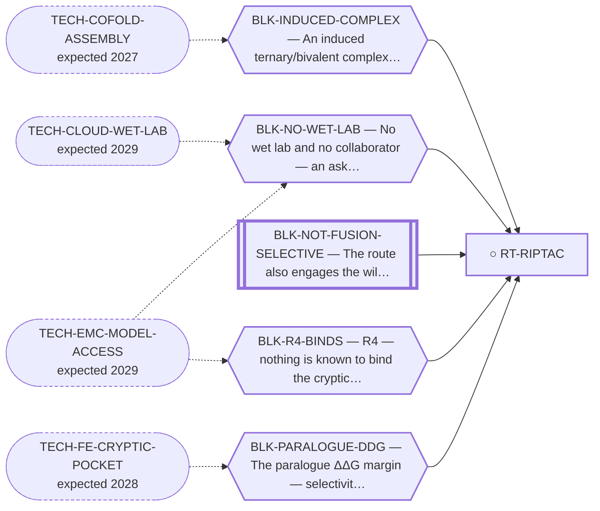

<!-- GENERATED FILE — DO NOT EDIT. Regenerate with:
     python3 systems/systems_check.py --write-views
     Source of truth: systems/graph/*.json -->

# RT-RIPTAC — RIPTAC — bind the tumour protein, poison an essential one

**Family:** [ST-PROXIMITY](L1-st-proximity.md) · **state:** ○ parked · concept · confidence low · verified 2026-08-05

**Grade** (owned by [`research/manuscripts/emc-post-degrader-options.md`](../../research/manuscripts/emc-post-degrader-options.md)): Tier 3 — needs paralogue selectivity AND a med-chem campaign; strictly worse than TCIP on both

## What has to land for this route to move

**Reading it.** A solid arrow is what holds this route down today. A dashed arrow is a capability that WOULD retire a blocker — dashed because it has not landed, and the date beside it is a forecast, not a schedule.

⛔ **1 of these is permanent** (`BLK-NOT-FUSION-SELECTIVE`) — a fact about the biology, drawn double-walled, with no way out by definition. No technology arrives to fix it.

## Scientific rationale

A RIPTAC does not degrade anything: it forms a complex that poisons an essential protein. It converts a selectivity problem into a lethality problem rather than removing it — and on this target that conversion is unfavourable, because the bound protein is the NR4A3 ligand-binding domain, which wild-type NR4A3 and both paralogues also carry. Any engagement outside the tumour is cytotoxic by the same mechanism, so partial selectivity is a liability here rather than a tolerance. No efficacy, safety or therapeutic window is asserted.

## Remaining unknowns

- Whether the paralogue selectivity this needs is achievable — it needs the same margin the program cannot measure.
- Whether a medicinal-chemistry campaign is even conceivable for one person with no bench.

## Required validation

| what | instrument | feasible today | blocked by |
|---|---|---|---|
| A measurable paralogue selectivity margin | ⛔ none built | **no** | BLK-PARALOGUE-DDG |

## Blockers

| blocker | kind | what would retire it |
|---|---|---|
| **BLK-INDUCED-COMPLEX** | `requires_better_structure_prediction` | `TECH-COFOLD-ASSEMBLY` |
| **BLK-NO-WET-LAB** | `requires_external_collaboration` | `TECH-CLOUD-WET-LAB`, `TECH-EMC-MODEL-ACCESS` |
| **BLK-NOT-FUSION-SELECTIVE** | `fundamental_biological_limit` | *permanent* |
| **BLK-PARALOGUE-DDG** | `requires_better_simulation_accuracy` | `TECH-FE-CRYPTIC-POCKET` |
| **BLK-R4-BINDS** | `requires_wet_lab` | `TECH-EMC-MODEL-ACCESS` |

## Not to be confused with

| route | the axis it turns on | blockers the distinction turns on | why |
|---|---|---|---|
| [RT-TCIP](L2-rt-tcip.md) | what the recruited partner does | `BLK-PARALOGUE-DDG`, `BLK-R4-BINDS` | a RIPTAC poisons an essential protein and therefore needs the paralogue selectivity a TCIP's effector recruitment can partly avoid; it is strictly worse on both axes and is registered so it is not re-proposed as 'TCIP-like' |

## Readiness — what this could become today

**`internal_note`**

It needs both the selectivity the program cannot measure and a chemistry campaign it cannot run. It is strictly harder than the proximity routes above it on both axes.

**Missing:**
- paralogue selectivity
- a chemistry programme

## Strategic timing — the wait equation

**Recommendation: `monitor`**

Strictly dominated by the induced-proximity routes: it needs everything they need plus a medicinal-chemistry campaign. There is no state of the world where this is the right next thing while they are still blocked.

| horizon | effect |
|---|---|
| Six months | None. |
| Two years | None. The free-energy advance alone does not reopen it — the induced complex and the unanswered binding question stand behind it. |
| Cost trend | flat |
| Automation outlook | The chemistry half is not automatable at this program's scale. |

**Revisit when:**
- **TECH-FE-CRYPTIC-POCKET** — A binding free-energy method — alchemical or ML — with a published known-answer validation on cryptic or induced-fit pockets, repr *(expected 2028, basis `extrapolated`)*
- **TECH-COFOLD-ASSEMBLY** — A sequence-only co-folder evaluated on ternary ASSEMBLY — inter-chain accuracy on post-training-horizon induced complexes — rather *(expected 2027, basis `evidence_based`)*
- **TECH-EMC-MODEL-ACCESS** — Access to a patient-derived EMC model through a collaborator, or through a solo-affordable cloud or robotic wet-lab service with E *(expected 2029, basis `speculative`)*

## Claim ceiling — what this route may NOT be used to claim

*Inherited from [ST-PROXIMITY](L1-st-proximity.md), which is where these are asserted — a family limitation binds every route inside it.*

- No molecule in this family has been shown to bind NR4A3 at all — the pocket every route here depends on has no known ligand of any kind.
- No NR4A3 ternary complex has been correctly assembled by anyone, so every geometry claim in this family is a prediction from an instrument that has never been pointed at this system.
- Nothing in this family asserts efficacy, safety, a therapeutic window or clinical readiness.

## Closure

`instrument_limit` — It needs the paralogue selectivity the program cannot measure, plus a med-chem campaign.

## Best next action

Keep registered. Do not build while the routes it is dominated by are still blocked.

*Cost:* $0

## What this route rests on — drill down

*L4 instruments and L5 objects, evidence and artifacts. Every row here is asserted by this route; the [evidence base](L5-evidence-base.md) shows the same edges from the other end.*

**L5 objects:** [OBJ-NR4A3-LBD-MODELLED](L5-evidence-base.md#objects--the-biological-and-molecular-entities-the-program-reasons-about)

[← ST-PROXIMITY](L1-st-proximity.md) · [← L0](L0-ecosystem.md)
