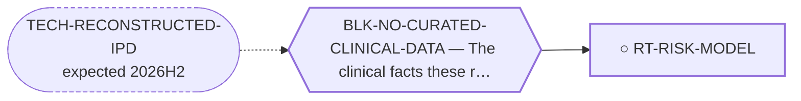

<!-- GENERATED FILE — DO NOT EDIT. Regenerate with:
     python3 systems/systems_check.py --write-views
     Source of truth: systems/graph/*.json -->

# RT-RISK-MODEL — A prognostic risk model for EMC

**Family:** [ST-CARE-DELIVERY](L1-st-care-delivery.md) · **state:** ○ ready · concept · confidence low · verified 2026-08-09

**Grade** (owned by [`systems/graph/routes.json`](../graph/routes.json)): No validated EMC risk model exists — `nomogram` returns zero files repo-wide and no published EMC series presents one. Size, site, age, rhabdoid features, cellularity and fusion partner are each reported prognostic somewhere, and never together. ⚠ Any model built on a few hundred reconstructed patients will be badly overfit unless it is held to a handful of predictors and reported with an honest optimism correction; a well-calibrated three-variable model is the realistic ceiling here.

## What has to land for this route to move

**Reading it.** A solid arrow is what holds this route down today. A dashed arrow is a capability that WOULD retire a blocker — dashed because it has not landed, and the date beside it is a forecast, not a schedule.

## Scientific rationale

Risk stratification is the mechanism by which every other route in this family becomes actionable — surveillance intensity, margin ambition and metastasectomy selection are all decisions about which patients, not whether. It falls out of the reconstructed dataset rather than needing an input of its own.

## Supporting evidence

| ref | supports | strength |
|---|---|---|
| `ART-CARE-DELIVERY-EVIDENCE` | tumour size as a prognostic factor in the molecularly-confirmed cohort, and the absence of any published EMC risk model | `direct` |

## Remaining unknowns

- Whether enough events exist across all reconstructable series to fit anything beyond two or three predictors without overfitting.
- Whether the covariates are even recoverable — a reconstruction returns times and event indicators, not the covariates that would stratify them, so a stratified model needs per-arm curves rather than one pooled curve.
- Whether fusion partner adds prognostic information over size and stage, which RT-PARTNER-STRAT bears on and which no series has tested jointly.

## Required validation

| what | instrument | feasible today | blocked by |
|---|---|---|---|
| Fit and internally validate a small model on the reconstructed dataset with an explicit optimism correction | ⛔ none built | **no** | BLK-NO-CURATED-CLINICAL-DATA |
| External validation in an independent cohort | ⛔ none built | **no** | BLK-REGISTRY-DUA |

## Blockers

| blocker | kind | what would retire it |
|---|---|---|
| **BLK-NO-CURATED-CLINICAL-DATA** | `insufficient_data` | `TECH-RECONSTRUCTED-IPD` |

## Readiness — what this could become today

**`internal_note`**

⚠ A reconstruction recovers times and events, NOT covariates. Stratification requires the source to have published a curve PER STRATUM, and most have not — which bounds this route more tightly than the others in the family.

**Missing:**
- the reconstructed dataset, and per-arm curves rather than pooled ones

## Where this route ends — the paper

**[PUB-CARE-DELIVERY](L3-publications.md)** — *What decides survival in extraskeletal myxoid chondrosarcoma, and what the literature has been looking at instead* (unwritten)

`contributing` · ○ `unwritten` · aimed at `preprint`

**This route contributes:** The stratification that turns the family's other three routes from observations into decisions.

**The paper would claim:** In extraskeletal myxoid chondrosarcoma the determinants of survival that have been studied least are the ones that decide it most: the completeness of the first operation, whether the diagnosis was known before it, and whether follow-up outlasts a disease that recurs for decades.

**It is not written because:** Its four contributing routes are registered and their evidence is cited but not yet extracted. The paper needs the reconstructed survival dataset (RT-IPD-SURVIVAL) to say anything quantitative; without it, it is an argument with citations rather than a result.

## Strategic timing — the wait equation

**Recommendation: `pursue_now`**

Every input is either committed or free to curate, and the work is $0.

| horizon | effect |
|---|---|
| Cost trend | flat |

## Claim ceiling — what this route may NOT be used to claim

*Inherited from [ST-CARE-DELIVERY](L1-st-care-delivery.md), which is where these are asserted — a family limitation binds every route inside it.*

- Nothing in this family produces a new agent, so its ceiling is bounded by what the existing arsenal can do — and its floor is that the arsenal is already being used, so the gain is variance-reduction rather than a new option.
- Every route here ends in an observational or modelled argument. No randomised trial will ever settle a surgical-margin or surveillance-interval question in a disease this rare, so the limits of the design must travel with every claim.
- Reconstructed and registry data are re-expressions of published records, never new patients — they inherit every selection and publication bias of the series they came from and can correct none of it.
- Treatment associations in observational sarcoma data are dominated by confounding by indication, which runs in the direction that makes therapy look harmful; a route here that reports an unadjusted hazard has produced an artefact, not a result.
- Nothing in this family asserts efficacy, safety, a therapeutic window or clinical readiness.

## Best next action

Wait on RT-IPD-SURVIVAL, and while waiting record which published EMC series print stratified curves at all — that census decides whether this route is possible.

*Cost:* $0

[← ST-CARE-DELIVERY](L1-st-care-delivery.md) · [← L0](L0-ecosystem.md)
