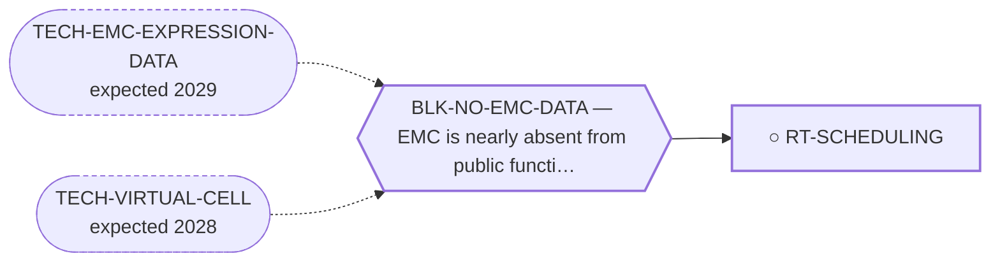

<!-- GENERATED FILE — DO NOT EDIT. Regenerate with:
     python3 systems/systems_check.py --write-views
     Source of truth: systems/graph/*.json -->

# RT-SCHEDULING — Adaptive and metronomic scheduling of existing agents

**Family:** [ST-STRATEGY](L1-st-strategy.md) · **state:** ○ blocked · concept · confidence low · verified 2026-08-09

**Grade** (owned by [`research/manuscripts/cancer-modality-census.md`](../../research/manuscripts/cancer-modality-census.md#36--strategy-and-reachability)): ⭑ Registered 2026-08-09 from the modality census, porting a 2026-08-07 lane and adding the comparator arm it lacked.

## What has to land for this route to move

**Reading it.** A solid arrow is what holds this route down today. A dashed arrow is a capability that WOULD retire a blocker — dashed because it has not landed, and the date beside it is a forecast, not a schedule.

## Scientific rationale

A registered lane with no route, plus the comparator it never had. Adaptive scheduling asks nothing new of chemistry and everything of timing, it costs nothing to model, and the 2026-08-07 sweep found this disease close to an ideal indication on several independent grounds. Metronomic dosing is the obvious alternative hypothesis and had never been named here at all, so the two are registered together and evaluated against each other.

## Remaining unknowns

- Whether a marker exists to adapt on, in a disease whose response endpoint is itself contested here.
- Whether the modelled advantage survives the small, heterogeneous and mostly retrospective data the model would be fitted to.

## Required validation

| what | instrument | feasible today | blocked by |
|---|---|---|---|
| The $0 analysis or registry sweep named in this route's next action | ⛔ none built | yes | — |
| Prospective confirmation, which no trial in this disease will supply | ⛔ none built | **no** | BLK-NO-WET-LAB |

## Blockers

| blocker | kind | what would retire it |
|---|---|---|
| **BLK-NO-EMC-DATA** | `insufficient_data` | `TECH-EMC-EXPRESSION-DATA`, `TECH-VIRTUAL-CELL` |

## Readiness — what this could become today

**`preprint`**

Nothing has been run. This route was registered on 2026-08-09 from the modality census and is at concept maturity, so the only honest output today is the question and its cheapest next observation.

**Missing:**
- the scheduling model on the pooled progression-free-survival data already curated here

## Where this route ends — the paper

**[PUB-STRATEGY-ARCH](L3-publications.md)** — *Scheduling, sequencing and reachability as treatment variables in an ultra-rare cancer* (unwritten)

`contributing` · ○ `unwritten` · aimed at `preprint`

**This route contributes:** One of the variables a clinician actually controls in a cancer that will never have a randomised trial — when, in what order, and whether the patient can reach anything.

**The paper would claim:** For a cancer that will never have a randomised trial, the variables a clinician actually controls — when, in what order, and whether the patient can reach a trial at all — are treatable as research questions, and a portfolio whose every endpoint is a publication needs the step after publication registered as a route.

**It is not written because:** Three of its four routes have not had their $0 analyses run, and the fourth is a registry sweep that has not been performed.

## Strategic timing — the wait equation

**Recommendation: `pursue_now`**

The next step costs nothing and needs nobody's cooperation, so there is no reason to defer it; what it returns decides whether this route is worth more than a row.

| horizon | effect |
|---|---|
| Cost trend | flat |

## Claim ceiling — what this route may NOT be used to claim

*Inherited from [ST-STRATEGY](L1-st-strategy.md), which is where these are asserted — a family limitation binds every route inside it.*

- Nothing in this family produces a new agent, so the ceiling of every route here is bounded by what the existing agents can do.
- Scheduling and sequencing questions are normally settled by randomised trials, and this disease will not have one — so every route here ends in a modelled or observational argument whose limits must travel with it.
- The reachability routes act on institutions rather than on biology, which is a domain where this program has no track record and where a wrong answer is not falsifiable by computation.
- Nothing in this family asserts efficacy, safety, a therapeutic window or clinical readiness.

## Best next action

Build the scheduling model on the pooled progression-free-survival data already curated here, with metronomic dosing as the comparator arm, and state the conditions under which each wins.

*Cost:* $0

[← ST-STRATEGY](L1-st-strategy.md) · [← L0](L0-ecosystem.md)
