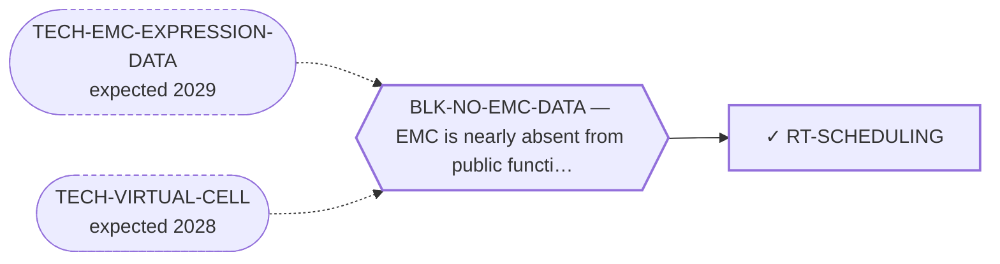

<!-- GENERATED FILE — DO NOT EDIT. Regenerate with:
     python3 systems/systems_check.py --write-views
     Source of truth: systems/graph/*.json -->

# RT-SCHEDULING — Adaptive and metronomic scheduling of existing agents

**Family:** [ST-STRATEGY](L1-st-strategy.md) · **state:** ✓ blocked · computed · confidence moderate · verified 2026-08-09

**Grade** (owned by [`research/manuscripts/emc-systemic-therapy-pooling.json`](../../research/manuscripts/emc-systemic-therapy-pooling.json)): ⚠ THE INPUT THE ROUTE NAMED DOES NOT EXIST AND MUST NOT BE BUILT (2026-08-09). The route's next step was 'build the scheduling model on the pooled progression-free-survival data already curated here'. ⛔ There is no pooled PFS and there cannot be one: the repository's evidence contract refuses to merge time-anchored endpoints, and the systemic pooling artifact refuses that pool explicitly rather than by omission. ⭐ What DOES exist is four EMC-specific medians that must be carried separately — two with confidence intervals, one with an observed range only, and one printed by its source with NO interval, NO range and NO number at risk. That is exactly a parameters-as-intervals model with one parameter that has no interval at all, which is a stronger specification than the pooled figure would have been. ⭐⭐ AND THE ROUTE ACQUIRES A SECOND, SHARPER CLAIM: four PFS figures circulate in this disease's literature attributed to agents that did not produce them — including one that is a median FOLLOW-UP quoted as a median PFS, from a paper whose own text says PFS was not reached.

## What has to land for this route to move

**Reading it.** A solid arrow is what holds this route down today. A dashed arrow is a capability that WOULD retire a blocker — dashed because it has not landed, and the date beside it is a forecast, not a schedule.

## Scientific rationale

A registered lane with no route, plus the comparator it never had. Adaptive scheduling asks nothing new of chemistry and everything of timing, it costs nothing to model, and the 2026-08-07 sweep found this disease close to an ideal indication on several independent grounds. Metronomic dosing is the obvious alternative hypothesis and had never been named here at all, so the two are registered together and evaluated against each other.

## Supporting evidence

| ref | supports | strength |
|---|---|---|
| `ART-SYSTEMIC-THERAPY-POOLING` | no pooled PFS exists or may be constructed under the evidence contract; four EMC-specific medians exist with heterogeneous dispersion reporting, one with none at all, and four widely-circulated EMC PFS figures are misattributions | `direct` |

## Remaining unknowns

- Whether a scheduling model is identifiable at all from four medians with mismatched dispersion, which is the sensitivity analysis the model exists to perform rather than a question to answer before it.
- What the growth and resistance parameters are, which no published EMC series reports and which the model must therefore carry as intervals rather than estimate.
- Whether the misattributed figures have propagated into any treatment guidance, which has not been checked and would raise the finding's weight considerably.

## Required validation

| what | instrument | feasible today | blocked by |
|---|---|---|---|
| The $0 analysis or registry sweep named in this route's next action | ⛔ none built | yes | — |
| Prospective confirmation, which no trial in this disease will supply | ⛔ none built | **no** | BLK-NO-WET-LAB |

## Blockers

| blocker | kind | what would retire it |
|---|---|---|
| **BLK-NO-EMC-DATA** | `insufficient_data` | `TECH-EMC-EXPRESSION-DATA`, `TECH-VIRTUAL-CELL` |

## Readiness — what this could become today

**`internal_note`**

The model has not been built. What changed is that its specification is now correct, where before it named an input the contract forbids.

**Missing:**
- nothing to start — the inputs are committed, and their shape is now known to be four separate medians rather than one pooled value

## Where this route ends — the paper

**[PUB-STRATEGY-ARCH](L3-publications.md)** — *Scheduling, sequencing and reachability as treatment variables in an ultra-rare cancer* (unwritten)

`contributing` · ◔ `outlined` · aimed at `preprint`

**This route contributes:** One of the variables a clinician actually controls in a cancer that will never have a randomised trial — when, in what order, and whether the patient can reach anything.

**The paper would claim:** For a cancer that will never have a randomised trial, the variables a clinician actually controls — when, in what order, and whether the patient can reach a trial at all — are treatable as research questions, and a portfolio whose every endpoint is a publication needs the step after publication registered as a route.

**It is not written because:** ⚠ ITS BLOCKER IS RETIRED AND ONE OF ITS ROUTES IS NOW THE MOST ACTIONABLE THING IN THE PORTFOLIO. All four routes are graded as of 2026-08-09, and two of the three '$0 analyses not run' had in fact run on 2026-08-07 and been committed without any route reading them. ⭐ THE REACHABILITY ROUTE IS READY AND ITS FINDING IS PUBLISHABLE WITHOUT ANY NEW SCIENCE: one confirmed fusion-family-defined recruiting trial and nine molecularly-defined trials admit this disease while never listing it as a condition — so a patient searching their own diagnosis would find none of them — and a registry-wide search for the driver gene returns five studies of which not one is oncology. ⛔ The other three are negatives, and they are clean ones: the scheduling model's named input does not exist and may not be built, because the evidence contract refuses to merge time-anchored endpoints — what exists is four separate medians, one printed by its source with no interval, no range and no number at risk, plus four PFS figures that circulate attributed to agents that did not produce them, one of which is a median FOLLOW-UP. Sequencing has no evidence base at all: no randomised evidence for any systemic therapy, every pooled denominator under sixty patients worldwide ever. ⛔ Superseded, retained: "three of its four routes have not had their $0 analyses run, and the fourth is a registry sweep that has not been performed." The sweep was performed two days before that sentence was written.

## Strategic timing — the wait equation

**Recommendation: `pursue_now`**

Every input is committed and the work is $0 model-building.

| horizon | effect |
|---|---|
| Cost trend | flat |

**Revisit when:**
- **TECH-EMC-EXPRESSION-DATA** — A fetchable public EMC RNA-seq or proteomics deposit beyond the single existing model, enabling a target-regulon readout and per-a *(expected 2029, basis `speculative`)*

## Claim ceiling — what this route may NOT be used to claim

*Inherited from [ST-STRATEGY](L1-st-strategy.md), which is where these are asserted — a family limitation binds every route inside it.*

- Nothing in this family produces a new agent, so the ceiling of every route here is bounded by what the existing agents can do.
- Scheduling and sequencing questions are normally settled by randomised trials, and this disease will not have one — so every route here ends in a modelled or observational argument whose limits must travel with it.
- The reachability routes act on institutions rather than on biology, which is a domain where this program has no track record and where a wrong answer is not falsifiable by computation.
- Nothing in this family asserts efficacy, safety, a therapeutic window or clinical readiness.

## Best next action

Build the two-population model with each median carried separately as its own parameter interval, and the one median that has no dispersion carried as a point with that stated — then report the four misattributed figures, which stand on their own.

*Cost:* $0

[← ST-STRATEGY](L1-st-strategy.md) · [← L0](L0-ecosystem.md)
