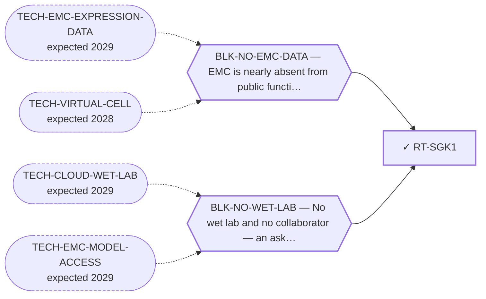

<!-- GENERATED FILE — DO NOT EDIT. Regenerate with:
     python3 systems/systems_check.py --write-views
     Source of truth: systems/graph/*.json -->

# RT-SGK1 — SGK1 inhibition

**Family:** [ST-DEPENDENCY](L1-st-dependency.md) · **state:** ✓ blocked · computed · confidence low · verified 2026-08-09

**Grade** (owned by [`research/modalities/census-route-expression-grading.json`](../../research/modalities/census-route-expression-grading.json)): ◐ DISCORDANT ON THE KINASE, CONCORDANT ON ITS SUBSTRATE (2026-08-09). SGK1 itself reads LOWER on one platform and HIGHER on the other, so the transcript does not corroborate the published antibody series. ⭐ Its canonical substrate NDRG1 is higher on BOTH, at the 98th percentile on one — which is an activity-shaped reading rather than an abundance one.

## What has to land for this route to move

**Reading it.** A solid arrow is what holds this route down today. A dashed arrow is a capability that WOULD retire a blocker — dashed because it has not landed, and the date beside it is a forecast, not a schedule.

## Scientific rationale

A registered lane with no route: a druggable AGC kinase reported positive across a full small series of tumours of this disease with an internal negative control, published two decades ago and never followed up by anyone.

## Supporting evidence

| ref | supports | strength |
|---|---|---|
| `ART-CENSUS-ROUTE-GRADING` | SGK1 transcript is discordant across the two platforms while its canonical substrate NDRG1 is concordantly higher on both, at the 98th array percentile on one | `direct` |

## Remaining unknowns

- Whether elevated substrate output reflects SGK1 activity or one of the other kinases that phosphorylate the same substrate — the reading cannot attribute it.
- Why the kinase transcript disagrees between platforms while its substrate does not, which is unexplained.
- Whether the published antibody series is corroborated at all — this pass did not corroborate it and did not refute it.

## Required validation

| what | instrument | feasible today | blocked by |
|---|---|---|---|
| The $0 corroboration named in this route's next action | ⛔ none built | yes | — |
| A functional measurement in a fusion-positive EMC model | ⛔ none built | **no** | BLK-NO-WET-LAB |
| A phospho-substrate or kinase-activity readout in an EMC model — the substrate signal is activity-shaped and abundance cannot attribute it to SGK1 rather than to another kinase acting on the same substrate | ⛔ none built | **no** | BLK-NO-WET-LAB |

## Blockers

| blocker | kind | what would retire it |
|---|---|---|
| **BLK-NO-EMC-DATA** | `insufficient_data` | `TECH-EMC-EXPRESSION-DATA`, `TECH-VIRTUAL-CELL` |
| **BLK-NO-WET-LAB** | `requires_external_collaboration` | `TECH-CLOUD-WET-LAB`, `TECH-EMC-MODEL-ACCESS` |

## Readiness — what this could become today

**`internal_note`**

A discordant primary gene with a concordant downstream signal is genuinely ambiguous, and reporting it as either support or refutation would overstate it.

**Missing:**
- a phospho-substrate or activity readout, which is what the substrate signal hints at and abundance cannot deliver

## Where this route ends — the paper

**[PUB-KINASE-LEADS](L3-publications.md)** — *Four kinase observations in extraskeletal myxoid chondrosarcoma that nobody followed up* (unwritten)

`contributing` · ○ `unwritten` · aimed at `preprint`

**This route contributes:** One of four kinase observations specific to this disease that exist in the published or curated record and that nobody has followed up.

**The paper would claim:** Four kinase-directed observations specific to this disease exist in the published and curated record — one reported as expressed and activated, one positive across a small series with an internal control, one an interaction curated on the driver protein itself, one an ex-vivo screen hit — and none has been followed up by anyone, in a disease with no targeted agent.

**It is not written because:** Its purpose is to consolidate four leads that are each individually thin, and the consolidation has not been done — three of the four were surfaced two days before this endpoint was registered.

## Strategic timing — the wait equation

**Recommendation: `monitor`**

The substrate reading makes an activity assay the decisive step, and that needs a model.

| horizon | effect |
|---|---|
| Cost trend | flat |

**Revisit when:**
- **TECH-EMC-MODEL-ACCESS** — Access to a patient-derived EMC model through a collaborator, or through a solo-affordable cloud or robotic wet-lab service with E *(expected 2029, basis `speculative`)*

## Claim ceiling — what this route may NOT be used to claim

*Inherited from [ST-DEPENDENCY](L1-st-dependency.md), which is where these are asserted — a family limitation binds every route inside it.*

- The dependency transfer prior came back negative on the available data — a measured premise, revivable only by EMC-specific data.
- One route rests on class inheritance: no NR4A3 fusion has been tested for the phenotype it assumes.
- There is one EMC model in public dependency data, with no CRISPR data, so this family's in-silico half is bounded by a sample size of one.

## Best next action

Read which other kinases phosphorylate the substrate, to size how much of the signal SGK1 could account for.

*Cost:* $0

[← ST-DEPENDENCY](L1-st-dependency.md) · [← L0](L0-ecosystem.md)
