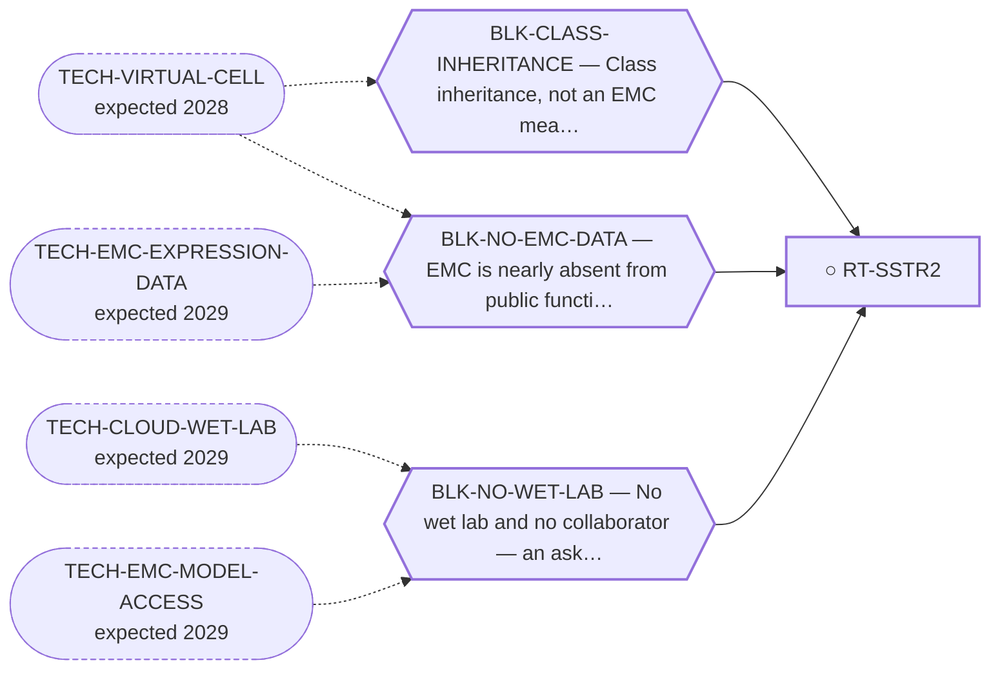

<!-- GENERATED FILE — DO NOT EDIT. Regenerate with:
     python3 systems/systems_check.py --write-views
     Source of truth: systems/graph/*.json -->

# RT-SSTR2 — SSTR2 / neuroendocrine theranostic

**Family:** [ST-RADIOLIGAND](L1-st-radioligand.md) · **state:** ○ blocked · concept · confidence unknown · verified 2026-08-05

**Grade** (owned by [`research/manuscripts/program/emc-post-degrader-options.md`](../../research/manuscripts/program/emc-post-degrader-options.md#route-7--sstr2--neuroendocrine-theranostic-the-cheapest-possible-confirm-and-the-clearest-case-of-cheapness-not-being-enough)): Tier 3 — demoted; W2 is the smallest imaginable and W1 is the problem

## What has to land for this route to move

**Reading it.** A solid arrow is what holds this route down today. A dashed arrow is a capability that WOULD retire a blocker — dashed because it has not landed, and the date beside it is a forecast, not a schedule.

✓ Already cleared by this route: `BLK-NOT-FUSION-SELECTIVE`, `BLK-PARALOGUE-DDG`, `BLK-TERNARY-GEOMETRY`.

## Scientific rationale

A theranostic gives imaging and therapy from one vector, and the imaging half is a cheap decisive test: a negative scan kills the route immediately and inexpensively. EMC has neuroendocrine-adjacent features that make the receptor worth checking.

## Supporting evidence

| ref | supports | strength |
|---|---|---|
| `ART-EMC-EXPRESSION-PANELS` | The EMC-tissue transcript half of required_validation[0]: gene_reads.SSTR2 is readable on GPL6244 in 6 EMC tumours, which says the gene is transcribed and says nothing about receptor density, protein or imaging avidity. | `direct` |

## Remaining unknowns

- Whether EMC expresses the receptor at all — this has never been measured.
- Whether expression is high enough for therapeutic rather than merely diagnostic use.
- SSTR2's normal-tissue window is ALREADY computed as ENHANCED_BROAD (emc-surface-normal-window.json), so a positive EMC scan does not settle the route — tumour-to-normal uptake ratio and dosimetry remain. Crossfire does not make a broadly-expressed normal antigen safer; it widens the irradiated field.

## Required validation

| what | instrument | feasible today | blocked by |
|---|---|---|---|
| A receptor imaging scan in an EMC patient, or an expression readout on EMC tissue  ⭐ ADJUDICATED 2026-09-02 (AUT-PD-116, seat s31-emc-data-blocks). HALF TAKEN, AND THE TAKEN HALF IS THE EXPRESSION DISJUNCT. `ART-EMC-EXPRESSION-PANELS` reads SSTR2 on EMC tumour tissue: `gene_reads.SSTR2.GSE24369_series_matrix.txt.gz.readable` is true on GPL6244 (not readable on GPL3290), and `reads.read_8_SURFACE_ANTIGEN.the_route_named_addresses.SSTR2` carries the contrast and its verdict. ⛔ THE IMAGING DISJUNCT IS UNTAKEN and is what this entry now waits on — a receptor scan in a patient is a bench and a clinic, so BLK-NO-WET-LAB is the whole of the residual. ⛔ A transcript read is not a receptor density, a protein or an imaging avidity: the artifact's `_what_this_cannot_conclude` refuses all three. SSTR2 has no assigned probe in the fourth cohort. ⚠ THE RULE THIS APPLIES, THE FOURTH COHORT'S DESIGN AND LIMITS, AND THE PER-GENE COVERAGE ALL HAVE ONE HOME AND ARE NOT RESTATED HERE: research/modalities/emc-fourth-cohort-route-readout.json — its "⭐ the_rule_this_adjudication_applies" field, its cohort block, and per_route.RT-SSTR2. | ⛔ none built | **no** | BLK-NO-WET-LAB |
| Tumour-to-normal uptake ratio and dosimetry on an SSTR2-avid EMC lesion | ⛔ none built | **no** | BLK-NO-WET-LAB |

## Blockers

| blocker | kind | what would retire it |
|---|---|---|
| **BLK-CLASS-INHERITANCE** | `insufficient_data` | `TECH-VIRTUAL-CELL` |
| **BLK-NO-EMC-DATA** | `insufficient_data` | `TECH-EMC-EXPRESSION-DATA`, `TECH-VIRTUAL-CELL` |
| **BLK-NO-WET-LAB** | `requires_external_collaboration` | `TECH-CLOUD-WET-LAB`, `TECH-EMC-MODEL-ACCESS` |

## Blockers this route RETIRES

- **BLK-PARALOGUE-DDG** — The paralogue ΔΔG margin — selectivity that reduces to exp(−ΔΔG/RT)
- **BLK-TERNARY-GEOMETRY** — Ternary geometry — assembly, E3, exit vector, ubiquitin transfer
- **BLK-NOT-FUSION-SELECTIVE** — The route also engages the wild-type protein (NR4A3 LBD, or EWSR1's low-complexity half)

## Not to be confused with

| route | the axis it turns on | blockers the distinction turns on | why |
|---|---|---|---|
| [RT-B7H3](L2-rt-b7h3.md) | which antigen and how it was graded | `BLK-NO-EMC-DATA` | SSTR2 is UNMEASURED in EMC; B7-H3 was MEASURED and came back not selective (BH q = 1.0). 'Surface-target route' names both and they failed differently |
| [RT-FAP-RLT](L2-rt-fap-rlt.md) | which radioligand target | `BLK-NO-EMC-DATA` | SSTR2 follows EMC's own neuroendocrine differentiation and its ask needs a clinician with an EMC patient; FAP targets the myxoid STROMA and its ask is an expression/avidity confirm |

## Readiness — what this could become today

**`experimental_proposal`**

It is a well-formed cheap ask with an unknown answer. There is no computation that would strengthen it — only a measurement.

**Missing:**
- any expression measurement in EMC

**Experiment required:**
- a receptor scan, or an expression readout on EMC tissue

## Where this route ends — the paper

**[PUB-SURFACE-TARGETS](L3-publications.md)** — [Fixed-panel tissue RNA prioritization in extraskeletal myxoid chondrosarcoma](../../research/manuscripts/surface-targets/emc-tissue-rna-prioritization.md)

`contributing` · ◐ `drafted` · aimed at `preprint`

**This route contributes:** The theranostic receptor arm, framed as a cheap decisive negative rather than as a lead — there is no computation that strengthens it, only a measurement.

**The paper would claim:** A fixed panel of 11 therapeutic-address genes, with CHRNA6 as a separate established RNA-marker control, can be assessed using within-cohort tissue RNA ranks and prespecified sarcoma comparators. In the overlap-reduced Hofvander cohort of nine primary EMC specimens, CSPG4 alone meets the frozen tissue-validation allocation rule; its LGFMS contrast agrees with the original GSE24369 array contrast, but year-deletion sensitivity and DFSP context limit generalization. This supports a qualified rationale for EMC tissue protein and compartment validation, not validated surface expression, normal sparing, treatment selection or efficacy. All other fixed-panel results and discordant protein/normal-context evidence are retained.

## Strategic timing — the wait equation

**Recommendation: `monitor`**

The cheapest possible negative in the entire portfolio: one scan settles it. A cheap decisive negative is worth having now, because it removes a row from the board permanently at almost no cost.

| horizon | effect |
|---|---|
| Six months | None on our side. |
| Two years | An EMC dataset would answer it without anyone scanning. |
| Cost trend | flat |
| Automation outlook | Not automatable; it is a measurement. |

**Revisit when:**
- **TECH-EMC-EXPRESSION-DATA** — A fetchable public EMC RNA-seq or proteomics deposit beyond the single existing model, enabling a target-regulon readout and per-a *(expected 2029, basis `speculative`)*

## Claim ceiling — what this route may NOT be used to claim

*Inherited from [ST-RADIOLIGAND](L1-st-radioligand.md), which is where these are asserted — a family limitation binds every route inside it.*

- Target expression in EMC is unmeasured; the case is currently inherited from neuroendocrine and stromal biology rather than observed in this disease.
- A radioligand target is not a driver, so nothing here would be evidence about the fusion.

## Closure

`authorization` — Not refuted — a negative scan still kills it cheaply, and it stays on the ask list.

## Best next action

Keep on the ask list. Frame it as a cheap decisive negative rather than as a promising lead — that is the honest framing and the one most likely to get it run.

*Cost:* $0

[← ST-RADIOLIGAND](L1-st-radioligand.md) · [← L0](L0-ecosystem.md)
