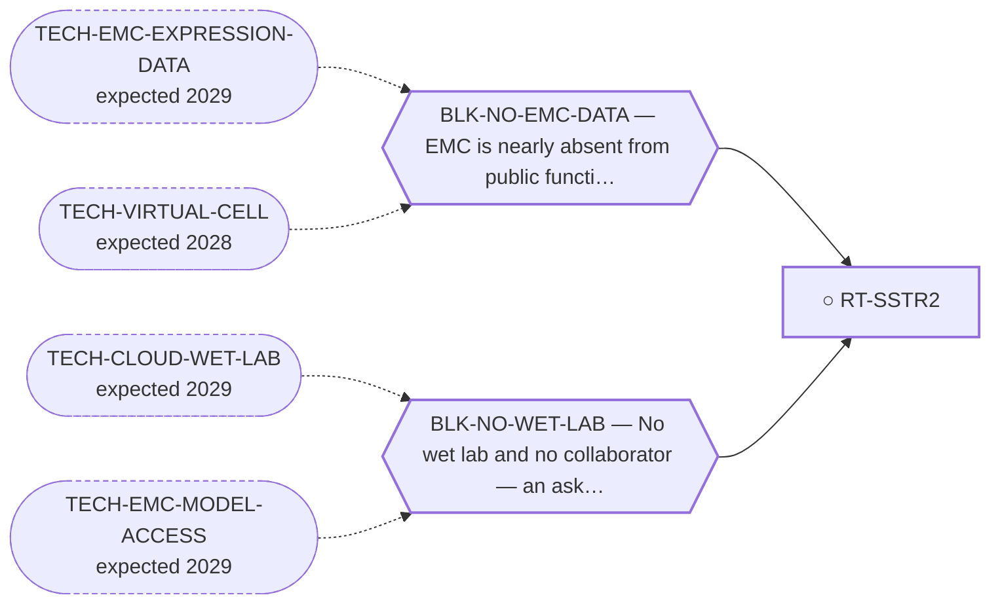

<!-- GENERATED FILE — DO NOT EDIT. Regenerate with:
     python3 systems/systems_check.py --write-views
     Source of truth: systems/graph/*.json -->

# RT-SSTR2 — SSTR2 / neuroendocrine theranostic

**Family:** [ST-RADIOLIGAND](L1-st-radioligand.md) · **state:** ○ blocked · concept · confidence unknown · verified 2026-08-05

**Grade** (owned by [`research/manuscripts/emc-post-degrader-options.md`](../../research/manuscripts/emc-post-degrader-options.md#route-7--sstr2--neuroendocrine-theranostic-the-cheapest-possible-confirm-and-the-clearest-case-of-cheapness-not-being-enough)): Tier 3 — demoted; W2 is the smallest imaginable and W1 is the problem

## What has to land for this route to move

**Reading it.** A solid arrow is what holds this route down today. A dashed arrow is a capability that WOULD retire a blocker — dashed because it has not landed, and the date beside it is a forecast, not a schedule.

✓ Already cleared by this route: `BLK-NOT-FUSION-SELECTIVE`, `BLK-PARALOGUE-DDG`, `BLK-TERNARY-GEOMETRY`.

## Scientific rationale

A theranostic gives imaging and therapy from one vector, and the imaging half is a cheap decisive test: a negative scan kills the route immediately and inexpensively. EMC has neuroendocrine-adjacent features that make the receptor worth checking.

## Remaining unknowns

- Whether EMC expresses the receptor at all — this has never been measured.
- Whether expression is high enough for therapeutic rather than merely diagnostic use.

## Required validation

| what | instrument | feasible today | blocked by |
|---|---|---|---|
| A receptor imaging scan in an EMC patient, or an expression readout on EMC tissue | ⛔ none built | **no** | BLK-NO-EMC-DATA, BLK-NO-WET-LAB |

## Blockers

| blocker | kind | what would retire it |
|---|---|---|
| **BLK-NO-WET-LAB** | `requires_external_collaboration` | `TECH-CLOUD-WET-LAB`, `TECH-EMC-MODEL-ACCESS` |
| **BLK-NO-EMC-DATA** | `insufficient_data` | `TECH-EMC-EXPRESSION-DATA`, `TECH-VIRTUAL-CELL` |

## Blockers this route RETIRES

- **BLK-PARALOGUE-DDG** — The paralogue ΔΔG margin — selectivity that reduces to exp(−ΔΔG/RT)
- **BLK-TERNARY-GEOMETRY** — Ternary geometry — assembly, E3, exit vector, ubiquitin transfer
- **BLK-NOT-FUSION-SELECTIVE** — The route also engages the wild-type protein (NR4A3 LBD, or EWSR1's low-complexity half)

## Readiness — what this could become today

**`experimental_proposal`**

It is a well-formed cheap ask with an unknown answer. There is no computation that would strengthen it — only a measurement.

**Missing:**
- any expression measurement in EMC

**Experiment required:**
- a receptor scan, or an expression readout on EMC tissue

## Strategic timing — the wait equation

**Recommendation: `pursue_now`**

The cheapest possible negative in the entire portfolio: one scan settles it. A cheap decisive negative is worth having now, because it removes a row from the board permanently at almost no cost.

| horizon | effect |
|---|---|
| Six months | None on our side. |
| Two years | An EMC dataset would answer it without anyone scanning. |
| Cost trend | flat |
| Automation outlook | Not automatable; it is a measurement. |

**Revisit when:**
- **TECH-EMC-EXPRESSION-DATA** — A fetchable public EMC RNA-seq or proteomics deposit beyond the single existing model, enabling a target-regulon readout and per-a *(expected 2029, basis `speculative`)*

## Closure

`authorization` — Not refuted — a negative scan still kills it cheaply, and it stays on the ask list.

## Best next action

Keep on the ask list. Frame it as a cheap decisive negative rather than as a promising lead — that is the honest framing and the one most likely to get it run.

*Cost:* $0

[← ST-RADIOLIGAND](L1-st-radioligand.md) · [← L0](L0-ecosystem.md)
