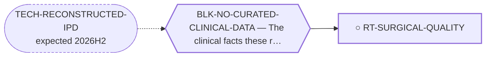

<!-- GENERATED FILE — DO NOT EDIT. Regenerate with:
     python3 systems/systems_check.py --write-views
     Source of truth: systems/graph/*.json -->

# RT-SURGICAL-QUALITY — The first operation — margin status, unplanned excision and treatment setting

**Family:** [ST-CARE-DELIVERY](L1-st-care-delivery.md) · **state:** ○ ready · concept · confidence low · verified 2026-08-26

**Grade** (owned by [`systems/graph/routes.json`](../graph/routes.json)): ⭐ THE LARGEST PUBLISHED SURVIVAL ASSOCIATION IN THIS DISEASE IS AN OPERATION, AND NO ROUTE ON THIS BOARD COVERED IT. In SEER locoregional EMC, surgery carried HR 0.27 (95% CI 0.16-0.47) univariate and HR 0.36 (0.19-0.69) in the adjusted sensitivity analysis (PMID 32856598). ⚠ The same analysis returns INFERIOR hazards for chemotherapy (1.90) and radiotherapy (1.45), which is textbook confounding by indication and must never be read as harm.

## What has to land for this route to move

**Reading it.** A solid arrow is what holds this route down today. A dashed arrow is a capability that WOULD retire a blocker — dashed because it has not landed, and the date beside it is a forecast, not a schedule.

## Scientific rationale

In soft-tissue sarcoma generally the completeness of the first resection is the largest modifiable survival determinant; in EMC, where nothing systemic has a demonstrated survival benefit, it is close to the only one. The terms this route is made of — R0/R1 margin, unplanned excision, re-excision, referral centre, volume-outcome — appear nowhere in this repository except inside the titles of papers it cites.

## Supporting evidence

| ref | supports | strength |
|---|---|---|
| `ART-CARE-DELIVERY-EVIDENCE` | surgery's hazard ratios in locoregional EMC, and the confounded chemo/RT hazards from the same analysis | `direct` |

## Remaining unknowns

- Whether treatment at a sarcoma referral centre changes EMC outcomes specifically. ⛔ THIS CANNOT BE ADVANCED BY THE REACHABLE LITERATURE and the reason is now measured rather than assumed: Masunaga reports no centre, centre volume or referral status, and every Chiusole patient was treated at one of two referral centres, so one source omits the exposure and the other holds it constant. It needs a series reporting where each patient was first operated, or a registry linkage carrying centre volume.
- What an unplanned excision rate in EMC is. Neither source carries the field. Masunaga's 'previous surgery' (18 of 171) and 'excisional' biopsy (10 of 171) are the nearest printed things and neither is defined as unplanned -- notably, the same Methods sentence that lists 'previous surgery' undefined DOES define R0/R1/R2, so the omission is visible.
- How much of the SEER surgery association is immortal-time and selection rather than effect, which the reconstructed dataset could bound and the published analyses do not.
- ⚠ Superseded, retained: "What the positive-margin rate in EMC actually is -- no cohort in the registry carries a margin field, and the one dedicated EMC surgical series reports a single positive margin in 13 patients." ANSWERED, and the answer is that the question was under-specified: two series print full distributions over 156 and 40 operated patients, and the rate is 22.4 % to 40.9 % depending on which denominator is meant. See ART-SURGICAL-QUALITY.

## Required validation

| what | instrument | feasible today | blocked by |
|---|---|---|---|
| Extract margin status and treatment setting from the open-access series already cited, and test against the reconstructed survival data | ⛔ none built | yes | — |
| A prospective or registry-linked analysis with margin recorded | ⛔ none built | **no** | BLK-REGISTRY-DUA |

## Blockers

| blocker | kind | what would retire it |
|---|---|---|
| **BLK-NO-CURATED-CLINICAL-DATA** | `insufficient_data` | `TECH-RECONSTRUCTED-IPD` |

## Readiness — what this could become today

**`internal_note`**

The margin distribution is curated, guarded and cross-checked, and Chiusole prints outcome by margin -- but 38 patients across two arms give a direction, not an effect size, and the association is confounded in the obvious way: whatever made a tumour impossible to clear is also a reason it recurs. The referral half of the route's question cannot be answered from reachable sources at all. ⚠ Superseded, retained: "The association is published and citable; what this route would ADD -- an EMC-specific margin and referral analysis -- needs fields nobody has extracted." Half of that is done: the margin fields are extracted. The referral half needs fields nobody has PUBLISHED, which is a different and harder problem.

**Missing:**
- treatment setting, which is unobtainable from the reachable literature rather than merely un-curated -- see remaining_unknowns
- the intent of each operation, without which no margin rate can be read as surgical performance: a positive margin in a metastatic patient is frequently a deliberate debulking
- ⚠ Superseded, retained: "margin status and treatment setting, which no curated cohort here records." Margin status is now recorded for 196 operated patients across two series.

## Where this route ends — the paper

**[PUB-CARE-DELIVERY](L3-publications.md)** — *What decides survival in extraskeletal myxoid chondrosarcoma, and what the literature has been looking at instead* (unwritten)

`contributing` · ○ `unwritten` · aimed at `preprint`

**This route contributes:** The largest measured survival association in the disease, and the one nobody here had written down.

**The paper would claim:** In extraskeletal myxoid chondrosarcoma the determinants of survival that have been studied least are the ones that decide it most: the completeness of the first operation, whether the diagnosis was known before it, and whether follow-up outlasts a disease that recurs for decades.

**It is not written because:** Its four contributing routes are registered and their evidence is cited but not yet extracted. The paper needs the reconstructed survival dataset (RT-IPD-SURVIVAL) to say anything quantitative; without it, it is an argument with citations rather than a result.

## Strategic timing — the wait equation

**Recommendation: `pursue_now`**

Every input is either committed or free to curate, and the work is $0.

| horizon | effect |
|---|---|
| Cost trend | flat |

## Claim ceiling — what this route may NOT be used to claim

*Inherited from [ST-CARE-DELIVERY](L1-st-care-delivery.md), which is where these are asserted — a family limitation binds every route inside it.*

- Nothing in this family produces a new agent, so its ceiling is bounded by what the existing arsenal can do — and its floor is that the arsenal is already being used, so the gain is variance-reduction rather than a new option.
- Every route here ends in an observational or modelled argument. No randomised trial will ever settle a surgical-margin or surveillance-interval question in a disease this rare, so the limits of the design must travel with every claim.
- Reconstructed and registry data are re-expressions of published records, never new patients — they inherit every selection and publication bias of the series they came from and can correct none of it.
- Treatment associations in observational sarcoma data are dominated by confounding by indication, which runs in the direction that makes therapy look harmful; a route here that reports an unadjusted hazard has produced an artefact, not a result.
- Nothing in this family asserts efficacy, safety, a therapeutic window or clinical readiness.

## Best next action

Decide whether an EMC margin note is worth writing from what is now in hand -- a positive-margin rate with an honest denominator range across two independent cohorts, plus Chiusole's outcome-by-margin contrast. ⛔ Do NOT re-curate these two papers for treatment setting or unplanned excision: both were measured absent, and the absence is a property of the publications, not of the curation.

*Cost:* $0

## What this route rests on — drill down

*L4 instruments and L5 objects, evidence and artifacts. Every row here is asserted by this route; the [evidence base](L5-evidence-base.md) shows the same edges from the other end.*

**L5 artifacts:** [ART-SURGICAL-QUALITY](L5-evidence-base.md#artifacts--the-files-a-claim-can-be-checked-against)

[← ST-CARE-DELIVERY](L1-st-care-delivery.md) · [← L0](L0-ecosystem.md)
