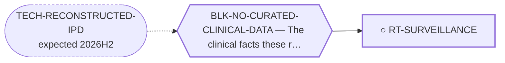

<!-- GENERATED FILE — DO NOT EDIT. Regenerate with:
     python3 systems/systems_check.py --write-views
     Source of truth: systems/graph/*.json -->

# RT-SURVEILLANCE — Surveillance duration and interval as the intervention

**Family:** [ST-CARE-DELIVERY](L1-st-care-delivery.md) · **state:** ○ ready · concept · confidence low · verified 2026-08-26

**Grade** (owned by [`systems/graph/routes.json`](../graph/routes.json)): The quantitative case is in one cohort. In 67 molecularly-confirmed, centrally-reviewed localised EMC patients, 10-year overall survival was 84% (69-98) against 10-year disease-free survival of 20% (7-33), with 52% relapsing (PMID 32572850). ⭐ The gap between those two numbers IS this route: most patients relapse, most are alive years later, and what happens in between is whether the recurrence was found while it could still be resected.  ⚠ INHERITS THE 2026-08-09 FEASIBILITY DOWNGRADE ON RT-IPD-SURVIVAL: only 19 of 340 EMC full texts print a Kaplan-Meier curve at all, so the reconstructed hazard this route consumes will rest on single-digit poolable curves and a few hundred patients. Whether that supports a decision-relevant model is now the route's first question rather than its last.

## What has to land for this route to move

**Reading it.** A solid arrow is what holds this route down today. A dashed arrow is a capability that WOULD retire a blocker — dashed because it has not landed, and the date beside it is a forecast, not a schedule.

## Scientific rationale

EMC recurs beyond the windows most surveillance protocols run to. If surveillance ends before the disease does, a resectable recurrence is found unresectable — and unlike almost everything else on this board, the question is a modelling question with committed inputs rather than a bench question. MOD-WATCHFUL-WAITING is graded `in_clinical_use` by the census, which is exactly why no route existed.

## Supporting evidence

| ref | supports | strength |
|---|---|---|
| `ART-CARE-DELIVERY-EVIDENCE` | the 10-year OS/DFS divergence in a molecularly-confirmed, centrally-reviewed localised cohort | `direct` |

## Remaining unknowns

- The hazard of recurrence as a function of time since resection. ⛔ STILL MISSING, AND PRINT CANNOT SUPPLY IT: what the reachable series publish is a median and, once, an IQR -- three points on a cumulative distribution, which cannot be differentiated into a hazard. The state-transition model needs what the route always said it needed.
- What fraction of recurrences are detected while still resectable under current practice, which no EMC series reports.
- Whether any surveillance benefit survives lead-time bias, which an observational design cannot settle and which the model must therefore carry explicitly. ⚠ Nothing in ART-RECURRENCE-TIMING advances this -- it measures when recurrence happens, never whether finding it sooner helps.
- ⚠ Whether the four-fold cross-cohort disagreement on time to distant metastasis (16 months against 5.9 years) is censoring or era. It is consistent with censoring and two cohorts cannot separate that from the 1980-2018 vs 2002-2022 imaging difference. A third series with a stated follow-up would discriminate it; none is reachable.

## Required validation

| what | instrument | feasible today | blocked by |
|---|---|---|---|
| Build a state-transition model on the reconstructed recurrence hazard and vary interval and duration | ⛔ none built | **no** | BLK-NO-CURATED-CLINICAL-DATA |

## Blockers

| blocker | kind | what would retire it |
|---|---|---|
| **BLK-NO-CURATED-CLINICAL-DATA** | `insufficient_data` | `TECH-RECONSTRUCTED-IPD` |

## Readiness — what this could become today

**`internal_note`**

The route's framing question -- does follow-up stop before the disease does -- is now answered with a within-cohort observation that needs no model: a quarter of one series' local recurrences occurred beyond its own median follow-up. That is an internal note's worth of finding. What it cannot become is a surveillance recommendation, because the hazard is unavailable and lead-time bias is untouched. ⚠ Superseded, retained: "The motivating divergence is published; the model needs a hazard function that only the reconstruction produces." The second clause is now known to be false as stated -- the reconstruction does not produce it either, for the reason in `missing`.

**Missing:**
- a hazard function, which no reachable publication prints and which summary statistics cannot be turned into
- resectability at detection, reported by no EMC series
- ⚠ Superseded, retained: "the time-resolved recurrence hazard, which RT-IPD-SURVIVAL would supply." RT-IPD-SURVIVAL has now produced patient-level data and it does NOT supply this: the reconstructable curves are progression-free and overall survival in advanced disease, not time-to-local-recurrence after resection, and the stratified curves that might carry it print no numbers-at-risk row.

## Where this route ends — the paper

**[PUB-CARE-DELIVERY](L3-publications.md)** — *What decides survival in extraskeletal myxoid chondrosarcoma, and what the literature has been looking at instead* (unwritten)

`contributing` · ○ `unwritten` · aimed at `preprint`

**This route contributes:** The disease's own natural history turned into a schedule, in the one place where timing and not chemistry decides the outcome.

**The paper would claim:** In extraskeletal myxoid chondrosarcoma the determinants of survival that have been studied least are the ones that decide it most: the completeness of the first operation, whether the diagnosis was known before it, and whether follow-up outlasts a disease that recurs for decades.

**It is not written because:** Its four contributing routes are registered and their evidence is cited but not yet extracted. The paper needs the reconstructed survival dataset (RT-IPD-SURVIVAL) to say anything quantitative; without it, it is an argument with citations rather than a result.

## Strategic timing — the wait equation

**Recommendation: `pursue_now`**

Every input is either committed or free to curate, and the work is $0.

| horizon | effect |
|---|---|
| Cost trend | flat |

## Claim ceiling — what this route may NOT be used to claim

*Inherited from [ST-CARE-DELIVERY](L1-st-care-delivery.md), which is where these are asserted — a family limitation binds every route inside it.*

- Nothing in this family produces a new agent, so its ceiling is bounded by what the existing arsenal can do — and its floor is that the arsenal is already being used, so the gain is variance-reduction rather than a new option.
- Every route here ends in an observational or modelled argument. No randomised trial will ever settle a surgical-margin or surveillance-interval question in a disease this rare, so the limits of the design must travel with every claim.
- Reconstructed and registry data are re-expressions of published records, never new patients — they inherit every selection and publication bias of the series they came from and can correct none of it.
- Treatment associations in observational sarcoma data are dominated by confounding by indication, which runs in the direction that makes therapy look harmful; a route here that reports an unadjusted hazard has produced an artefact, not a result.
- Nothing in this family asserts efficacy, safety, a therapeutic window or clinical readiness.

## Best next action

⛔ Do NOT wait on RT-IPD-SURVIVAL for this -- it has produced data and the data is the wrong shape, which is now recorded. The honest options are to write the observation up as a short note (a judgement call about what we publish, not a technical one) or to leave the route open against a series that prints a time-to-recurrence curve WITH numbers at risk. ⚠ Superseded, retained: "Wait on RT-IPD-SURVIVAL for the recurrence hazard, then build the state-transition model."

*Cost:* $0

## What this route rests on — drill down

*L4 instruments and L5 objects, evidence and artifacts. Every row here is asserted by this route; the [evidence base](L5-evidence-base.md) shows the same edges from the other end.*

**L5 artifacts:** [ART-RECURRENCE-TIMING](L5-evidence-base.md#artifacts--the-files-a-claim-can-be-checked-against)

[← ST-CARE-DELIVERY](L1-st-care-delivery.md) · [← L0](L0-ecosystem.md)
