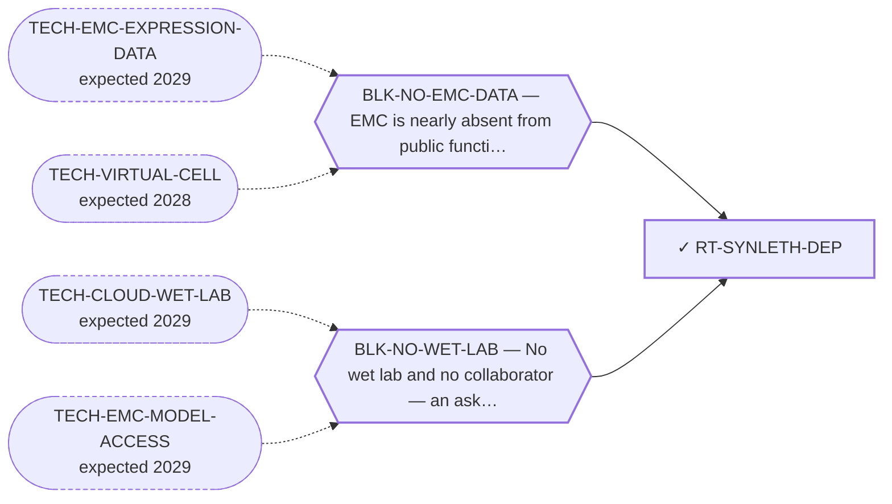

<!-- GENERATED FILE — DO NOT EDIT. Regenerate with:
     python3 systems/systems_check.py --write-views
     Source of truth: systems/graph/*.json -->

# RT-SYNLETH-DEP — Synthetic-lethal / dependency partner (BRD9 / ncBAF via EWSR1-prion→BAF)

**Family:** [ST-DEPENDENCY](L1-st-dependency.md) · **state:** ✓ parked · computed · confidence moderate · verified 2026-08-05

**Grade** (owned by [`research/manuscripts/dependency/degrader-vs-synthetic-lethal.md`](../../research/manuscripts/dependency/degrader-vs-synthetic-lethal.md)): DOWNGRADED — DepMap 24Q4 transfer prior negative; ⏸ parked on data, not on ideas

## What has to land for this route to move

**Reading it.** A solid arrow is what holds this route down today. A dashed arrow is a capability that WOULD retire a blocker — dashed because it has not landed, and the date beside it is a forecast, not a schedule.

✓ Already cleared by this route: `BLK-PARALOGUE-DDG`, `BLK-R4-BINDS`, `BLK-TERNARY-GEOMETRY`.

## Scientific rationale

A synthetic-lethal partner would be an ordinary, already-druggable protein that is only essential because the fusion is present. That removes both the undruggability problem and the selectivity problem at once, and it is the cleanest theoretical escape from everything blocking the lead family.

## Supporting evidence

| ref | supports | strength |
|---|---|---|
| `ART-DEPMAP-SARCOMA-DEP` | the ncBAF/BRD9 dependency transfer prior, negative on the available data (BRD9 sarcoma_mean 0.105, selectivity -0.016) — computed over 91 sarcoma lines, NONE of them EMC | `transferred` |

## Remaining unknowns

- NO EMC model is in public dependency data. The one DepMap model labelled EMC (ACH-001519 / H-EMC-SS) has no CRISPR data AND its identity is disputed on the curated record, so the transfer prior rests on 91 sarcoma lines none of which is EMC — a stronger bound than 'n = 1'.
- Whether a chromatin-complex dependency exists that the transfer prior could not see.

## Required validation

| what | instrument | feasible today | blocked by |
|---|---|---|---|
| An EMC-specific dependency screen  ⭐ ADJUDICATED 2026-09-02 (AUT-PD-116, seat s31-emc-data-blocks, applying S41). TESTED AND CORRECT AS FILED — this is the one class of requirement BLK-NO-EMC-DATA does hold. "An EMC-specific dependency screen" is verbatim the first half of the blocker's own `retired_by_action`. Nothing changes; the entry is now a tested attribution rather than an untested one. Per-entry justification: research/autonomy/sprint-2026-09-01/S41-BLOCKED-ROUTE-AUDIT.md and S41-proposed-routes-patch.json. The rule this applies has one home: research/modalities/emc-fourth-cohort-route-readout.json → "⭐ the_rule_this_adjudication_applies". | ⛔ none built | **no** | BLK-NO-EMC-DATA, BLK-NO-WET-LAB |

## Blockers

| blocker | kind | what would retire it |
|---|---|---|
| **BLK-NO-EMC-DATA** | `insufficient_data` | `TECH-EMC-EXPRESSION-DATA`, `TECH-VIRTUAL-CELL` |
| **BLK-NO-WET-LAB** | `requires_external_collaboration` | `TECH-CLOUD-WET-LAB`, `TECH-EMC-MODEL-ACCESS` |

## Blockers this route RETIRES

- **BLK-PARALOGUE-DDG** — The paralogue ΔΔG margin — selectivity that reduces to exp(−ΔΔG/RT)
- **BLK-TERNARY-GEOMETRY** — Ternary geometry — assembly, E3, exit vector, ubiquitin transfer
- **BLK-R4-BINDS** — R4 — nothing is known to bind the cryptic pocket at all

## Not to be confused with

| route | the axis it turns on | blockers the distinction turns on | why |
|---|---|---|---|
| [RT-ATR-ASSESS](L2-rt-atr-assess.md) | where the dependency comes from | `BLK-NO-EMC-DATA` | 'synthetic lethality' names both. This one is a DepMap transfer prior that came back negative; the ATR route is a class inheritance from a published FET-family argument with its own structural precondition computed |

## Readiness — what this could become today

**`internal_note`**

Parked on DATA rather than on ideas. A negative derived from a transfer prior over one cell line is not a result that can carry a publication.

**Missing:**
- EMC-specific functional-genomics data

## Where this route ends — the paper

**[PUB-SYNLETH](L3-publications.md)** — [Degrader vs. synthetic-lethal for EWSR1::NR4A3 EMC — a feasibility comparison](../../research/manuscripts/dependency/degrader-vs-synthetic-lethal.md)

`primary` · ◐ `drafted` · aimed at `internal_note`

**This route contributes:** The BRD9/ncBAF dependency argument, and the data-bounded negative that follows from a transfer prior over one cell line.

**The paper would claim:** A BRD9/ncBAF dependency is the best-motivated synthetic-lethal candidate for a FET fusion, and the negative recorded here is bounded by a transfer prior over a single cell line — a statement about the available data, not about the biology.

## Strategic timing — the wait equation

**Recommendation: `wait`**

This is the family most starved by the data blocker and the one that would benefit most from it landing. Further reasoning against a sample size of one produces confident-sounding conclusions with no evidential base, which is the failure mode the whole register exists to prevent.

| horizon | effect |
|---|---|
| Six months | None without data. |
| Two years | Substantial — either an EMC dataset or a perturbation model that generalises to unseen cell types would reopen this properly. |
| Cost trend | flat |
| Automation outlook | High — the screen re-runs automatically once data exists. |

**Revisit when:**
- **TECH-EMC-EXPRESSION-DATA** — A fetchable public EMC RNA-seq or proteomics deposit beyond the single existing model, enabling a target-regulon readout and per-a *(expected 2029, basis `speculative`)*
- **TECH-EMC-MODEL-ACCESS** — Access to a patient-derived EMC model through a collaborator, or through a solo-affordable cloud or robotic wet-lab service with E *(expected 2029, basis `speculative`)*
- **TECH-VIRTUAL-CELL** — A virtual-cell or perturbation model that predicts held-out knockdown phenotype in a cell type it was not trained on *(expected 2028, basis `extrapolated`)*

## Claim ceiling — what this route may NOT be used to claim

*Inherited from [ST-DEPENDENCY](L1-st-dependency.md), which is where these are asserted — a family limitation binds every route inside it.*

- The dependency transfer prior came back negative on the available data — a measured premise, revivable only by EMC-specific data.
- One route rests on class inheritance: no NR4A3 fusion has been tested for the phenotype it assumes.
- There is one EMC model in public dependency data, with no CRISPR data, so this family's in-silico half is bounded by a sample size of one.

## Closure

`premise_false` — The DepMap transfer prior came back negative — a measured premise, revivable only by EMC-specific data, which is why it is parked on data and not on ideas.

## Best next action

Keep parked on data with the transfer-prior negative stated as data-bounded, not as a biological finding.

*Cost:* $0

## What this route rests on — drill down

*L4 instruments and L5 objects, evidence and artifacts. Every row here is asserted by this route; the [evidence base](L5-evidence-base.md) shows the same edges from the other end.*

**L5 artifacts:** [ART-DEPMAP-SARCOMA-DEP](L5-evidence-base.md#artifacts--the-files-a-claim-can-be-checked-against)

[← ST-DEPENDENCY](L1-st-dependency.md) · [← L0](L0-ecosystem.md)
