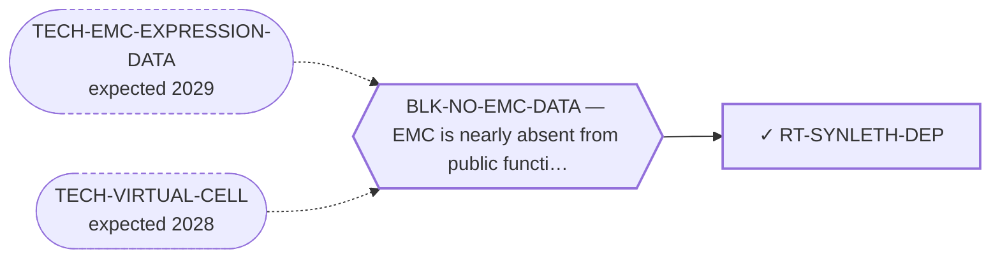

<!-- GENERATED FILE — DO NOT EDIT. Regenerate with:
     python3 systems/systems_check.py --write-views
     Source of truth: systems/graph/*.json -->

# RT-SYNLETH-DEP — Synthetic-lethal / dependency partner (BRD9 / ncBAF via EWSR1-prion→BAF)

**Family:** [ST-DEPENDENCY](L1-st-dependency.md) · **state:** ✓ parked · computed · confidence moderate · verified 2026-08-05

**Grade** (owned by [`research/manuscripts/degrader-vs-synthetic-lethal.md`](../../research/manuscripts/degrader-vs-synthetic-lethal.md)): DOWNGRADED — DepMap 24Q4 transfer prior negative; ⏸ parked on data, not on ideas

## What has to land for this route to move

**Reading it.** A solid arrow is what holds this route down today. A dashed arrow is a capability that WOULD retire a blocker — dashed because it has not landed, and the date beside it is a forecast, not a schedule.

✓ Already cleared by this route: `BLK-PARALOGUE-DDG`, `BLK-R4-BINDS`, `BLK-TERNARY-GEOMETRY`.

## Scientific rationale

A synthetic-lethal partner would be an ordinary, already-druggable protein that is only essential because the fusion is present. That removes both the undruggability problem and the selectivity problem at once, and it is the cleanest theoretical escape from everything blocking the lead family.

## Supporting evidence

| ref | supports | strength |
|---|---|---|
| `INS-DEPMAP-KO` | the dependency transfer prior, which came back negative on the available data | `transferred` |

## Remaining unknowns

- Whether the negative reflects EMC biology or the sample size: there is one EMC model in public dependency data, with no knockout screen data.
- Whether a chromatin-complex dependency exists that the transfer prior could not see.

## Required validation

| what | instrument | feasible today | blocked by |
|---|---|---|---|
| An EMC-specific dependency screen | ⛔ none built | **no** | BLK-NO-EMC-DATA |

## Blockers

| blocker | kind | what would retire it |
|---|---|---|
| **BLK-NO-EMC-DATA** | `insufficient_data` | `TECH-EMC-EXPRESSION-DATA`, `TECH-VIRTUAL-CELL` |

## Blockers this route RETIRES

- **BLK-PARALOGUE-DDG** — The paralogue ΔΔG margin — selectivity that reduces to exp(−ΔΔG/RT)
- **BLK-TERNARY-GEOMETRY** — Ternary geometry — assembly, E3, exit vector, ubiquitin transfer
- **BLK-R4-BINDS** — R4 — nothing is known to bind the cryptic pocket at all

## Readiness — what this could become today

**`internal_note`**

Parked on DATA rather than on ideas. A negative derived from a transfer prior over one cell line is not a result that can carry a publication.

**Missing:**
- EMC-specific functional-genomics data

## Strategic timing — the wait equation

**Recommendation: `wait`**

This is the family most starved by the data blocker and the one that would benefit most from it landing. Further reasoning against a sample size of one produces confident-sounding conclusions with no evidential base, which is the failure mode the whole register exists to prevent.

| horizon | effect |
|---|---|
| Six months | None without data. |
| Two years | Substantial — either an EMC dataset or a perturbation model that generalises to unseen cell types would reopen this properly. |
| Cost trend | flat |
| Automation outlook | High — the screen re-runs automatically once data exists. |

**Revisit when:**
- **TECH-EMC-EXPRESSION-DATA** — A fetchable public EMC RNA-seq or proteomics deposit beyond the single existing model, enabling a target-regulon readout and per-a *(expected 2029, basis `speculative`)*
- **TECH-VIRTUAL-CELL** — A virtual-cell or perturbation model that predicts held-out knockdown phenotype in a cell type it was not trained on *(expected 2028, basis `extrapolated`)*

## Closure

`premise_false` — The DepMap transfer prior came back negative — a measured premise, revivable only by EMC-specific data, which is why it is parked on data and not on ideas.

## Best next action

Keep parked on data with the transfer-prior negative stated as data-bounded, not as a biological finding.

*Cost:* $0

[← ST-DEPENDENCY](L1-st-dependency.md) · [← L0](L0-ecosystem.md)
