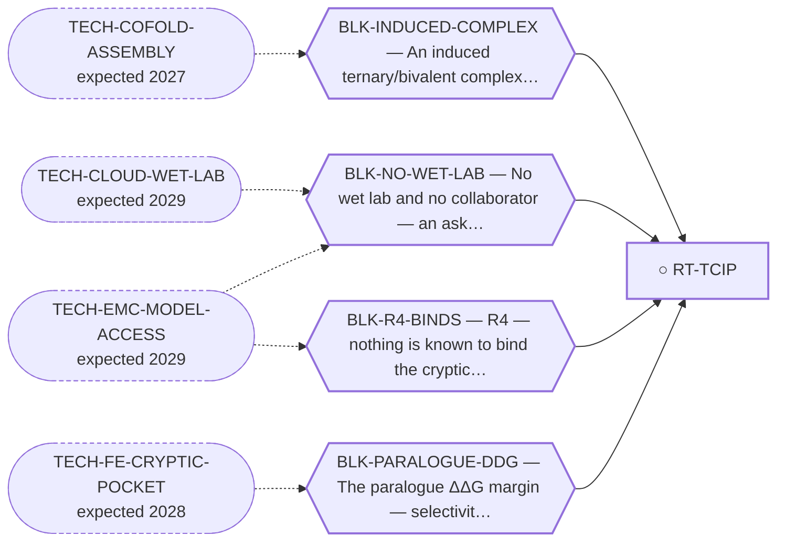

<!-- GENERATED FILE — DO NOT EDIT. Regenerate with:
     python3 systems/systems_check.py --write-views
     Source of truth: systems/graph/*.json -->

# RT-TCIP — TCIP — transcriptional chemically-induced proximity on EWSR1::NR4A3

**Family:** [ST-PROXIMITY](L1-st-proximity.md) · **state:** ○ blocked · scoped · confidence low · verified 2026-08-05

**Grade** (owned by [`research/manuscripts/emc-post-degrader-options.md`](../../research/manuscripts/emc-post-degrader-options.md)): Tier 3 — demoted from Tier 2; the cheapest promotion available in the memo

## What has to land for this route to move

**Reading it.** A solid arrow is what holds this route down today. A dashed arrow is a capability that WOULD retire a blocker — dashed because it has not landed, and the date beside it is a forecast, not a schedule.

✓ Already cleared by this route: `BLK-TERNARY-GEOMETRY`.

## Scientific rationale

A transcriptional chemical inducer of proximity brings an effector to a DNA-bound transcription factor rather than removing it. Because the fusion is itself a transcriptional driver, an effector that shuts down its output could work without the protein ever being degraded — which sidesteps the entire ubiquitin-transfer geometry problem.

## Remaining unknowns

- Whether the linker geometry works with a transcriptional effector as the second terminus — the enumeration was built for an E3 and has never been run for this configuration.
- Whether the paralogue selectivity requirement is any smaller here; it has not been sized.

## Required validation

| what | instrument | feasible today | blocked by |
|---|---|---|---|
| The paired reach enumeration run with a transcriptional-effector second terminus | ⛔ none built | yes | — |
| A ternary geometry for the induced complex | ⛔ none built | **no** | BLK-INDUCED-COMPLEX |

## Blockers

| blocker | kind | what would retire it |
|---|---|---|
| **BLK-R4-BINDS** | `requires_wet_lab` | `TECH-EMC-MODEL-ACCESS` |
| **BLK-INDUCED-COMPLEX** | `requires_better_structure_prediction` | `TECH-COFOLD-ASSEMBLY` |
| **BLK-PARALOGUE-DDG** | `requires_better_simulation_accuracy` | `TECH-FE-CRYPTIC-POCKET` |
| **BLK-NO-WET-LAB** | `requires_external_collaboration` | `TECH-CLOUD-WET-LAB`, `TECH-EMC-MODEL-ACCESS` |

## Blockers this route RETIRES

- **BLK-TERNARY-GEOMETRY** — Ternary geometry — assembly, E3, exit vector, ubiquitin transfer

## Readiness — what this could become today

**`reproducible_workflow`**

The enumeration machinery exists and takes one more anchor set. Until it has run there is no result to report.

**Missing:**
- the enumeration run for this configuration

## Strategic timing — the wait equation

**Recommendation: `pursue_now`**

This is the cheapest promotion available anywhere in the options register: the machinery is built and needs one more input set. It was demoted for an UNRUN computation rather than a failed one, which is a reason to run it, not a reason to wait.

| horizon | effect |
|---|---|
| Six months | None — the work is available now. |
| Two years | Better induced-complex prediction would make the result interpretable rather than merely geometric. |
| Cost trend | flat |
| Automation outlook | Fully automatable; it is a $0 enumeration. |

## Closure

`instrument_limit` — Demoted for an UNRUN computation, not a failed one — which is why it is the cheapest promotion in the memo.

## Best next action

Run the paired anchor-plus-effector reach enumeration with a transcriptional-effector second terminus, reusing the E3-free machinery.

*Cost:* $0

[← ST-PROXIMITY](L1-st-proximity.md) · [← L0](L0-ecosystem.md)
