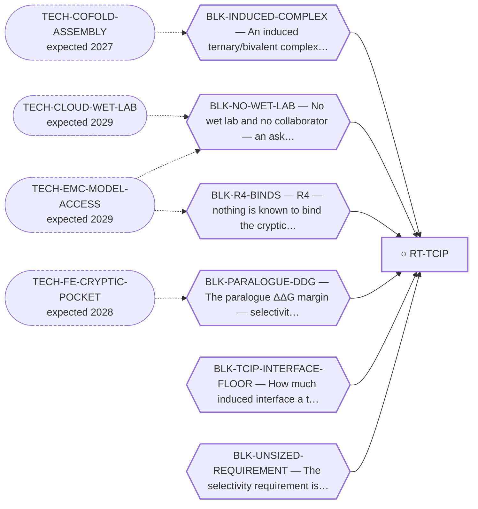

<!-- GENERATED FILE — DO NOT EDIT. Regenerate with:
     python3 systems/systems_check.py --write-views
     Source of truth: systems/graph/*.json -->

# RT-TCIP — TCIP — transcriptional chemically-induced proximity on EWSR1::NR4A3

**Family:** [ST-PROXIMITY](L1-st-proximity.md) · **state:** ○ blocked · scoped · confidence low · verified 2026-08-06

**Grade** (owned by [`research/manuscripts/program/emc-post-degrader-options.md`](../../research/manuscripts/program/emc-post-degrader-options.md)): Tier 3 — demoted from Tier 2; the cheapest promotion available in the memo

## What has to land for this route to move

**Reading it.** A solid arrow is what holds this route down today. A dashed arrow is a capability that WOULD retire a blocker — dashed because it has not landed, and the date beside it is a forecast, not a schedule.

⚠ **2 blockers here have no technology named at all** (`BLK-TCIP-INTERFACE-FLOOR`, `BLK-UNSIZED-REQUIREMENT`) — not *waiting*, **unaddressed**. A blocker with no named way out is the most expensive kind, because nothing is being watched for it.

✓ Already cleared by this route: `BLK-TERNARY-GEOMETRY`.

## Scientific rationale

A transcriptional chemical inducer of proximity brings an effector to a DNA-bound transcription factor rather than removing it. Because the fusion is itself a transcriptional driver, an effector that shuts down its output could work without the protein ever being degraded — which sidesteps the entire ubiquitin-transfer geometry problem.

## Remaining unknowns

- Whether the geometry holds for a NAMED transcriptional effector. The enumeration has now been run, but the repository stages 0 transcriptional-effector bodies — all 4 staged second-terminus bodies are E3 ligase recruiters, and the two used at effector size (birc2, mdm2) are explicit size-and-shape proxies.
- Which interface floor a transcriptional CIP actually requires. The committed floor (min_contact_residues=12) is a DEGRADER'S parameter, the result inverts across it, and the requirement is now STATED as a residence-time requirement whose calibration constant is unavailable (BLK-TCIP-INTERFACE-FLOOR; REQ-TCIP-1). Operative requirement meanwhile: report at both floors and assert only what holds at both (REQ-TCIP-2).
- Whether the paralogue selectivity requirement is any smaller here. ⛔ It is now SIZED IN FORM and it is NOT smaller: REQ-TCIP-3 needs the same odds-product difference in induced-complex-fraction space, over a dose range bounded above by the hook, and its anti-target ceiling has NO candidate source at all — a TCIP engaging NR4A1 REWIRES it rather than removing it, so the loss-of-function genotype that bounds the degrader's anti-target event does not bound this one.

## Required validation

| what | instrument | feasible today | blocked by |
|---|---|---|---|
| The paired reach enumeration run with an effector-size second terminus — ✅ DONE 2026-08-06, ART-TCIP-REACH | ⛔ none built | yes | — |
| A staged transcriptional-effector body, so the result can name an effector rather than a size class — ✅ DONE 2026-08-06: BCL6 (7LWG, BTB/POZ repressor, ligand YN7, exit atom inside the committed E3 exit-exposure range) staged via CI RCSB fetch, nr4a3-effector-arm-registry.json. Chosen from the route's own motivating paper, which names BCL6 as what EB-TCIP recruits. ⚠ The enumeration re-run with the real arm is not yet landed, so every published TCIP number remains size-class-only until it is. | ⛔ none built | yes | — |
| A ternary geometry for the induced complex | ⛔ none built | **no** | BLK-INDUCED-COMPLEX |

## Blockers

| blocker | kind | what would retire it |
|---|---|---|
| **BLK-INDUCED-COMPLEX** | `requires_better_structure_prediction` | `TECH-COFOLD-ASSEMBLY` |
| **BLK-NO-WET-LAB** | `requires_external_collaboration` | `TECH-CLOUD-WET-LAB`, `TECH-EMC-MODEL-ACCESS` |
| **BLK-PARALOGUE-DDG** | `requires_better_simulation_accuracy` | `TECH-FE-CRYPTIC-POCKET` |
| **BLK-R4-BINDS** | `requires_wet_lab` | `TECH-EMC-MODEL-ACCESS` |
| **BLK-TCIP-INTERFACE-FLOOR** | `insufficient_data` | Find, for ANY chemically-induced transcriptional-proximity system, a relationship between a CHARACTERISED induced interface (size, cooperativity, or induced-complex residence time) and transcriptional output — MISSING-3. ⛔ Measured 2026-08-07 at $0 by reading the committed full text of the route's own motivating source on the literature-cache branch: `cooperativ*` 0 occurrences, `linker` 0, `contact residue` 0, `interface` only inside a reference title, and no structure of the induced complex. That source characterises the ternary complex functionally and not structurally, so it does not supply the input. Supporting Information was not in the cache and is the one place left to look before this escalates to requires_wet_lab. Until then REQ-TCIP-2 (report at both floors, assert only what holds at both) is the route's operative requirement. |
| **BLK-UNSIZED-REQUIREMENT** | `requires_wet_lab` | Obtain the three dose-responses named as MISSING-1, MISSING-2 and MISSING-4 in selectivity-requirement-sizing.md. Until then the thresholds stay as stated forms with an explicit range and no upper bound. ⛔ NOT retired by any computation: a genotype bounds developmental, complete, lifelong loss and cannot be inverted into an adult tolerated occupancy, and no in-silico instrument produces an occupancy-to-output transfer function. |

## Blockers this route RETIRES

- **BLK-TERNARY-GEOMETRY** — Ternary geometry — assembly, E3, exit vector, ubiquitin transfer

## Not to be confused with

| route | the axis it turns on | blockers the distinction turns on | why |
|---|---|---|---|
| [RT-MONOVALENT](L2-rt-monovalent.md) | how many termini the molecule has | `BLK-INDUCED-COMPLEX`, `BLK-R4-BINDS` | a TCIP is still bivalent, so the reach result computed for the monovalent configuration DOES NOT TRANSFER to it — a different second terminus is a different enumeration, and running it is an open $0 item |
| [RT-DEGRADER](L2-rt-degrader.md) | what the recruited partner does | `BLK-INDUCED-COMPLEX` | TCIP recruits a transcriptional effector rather than an E3, so it retires the ubiquitin-transfer geometry while keeping the induced-complex problem |
| [RT-RIPTAC](L2-rt-riptac.md) | what the recruited partner does | `BLK-INDUCED-COMPLEX`, `BLK-R4-BINDS` | a TCIP recruits a transcriptional effector; a RIPTAC recruits an essential protein to poison it, which reinstates the full paralogue-selectivity requirement a TCIP can partly avoid |

## Readiness — what this could become today

**`preprint`**

The enumeration has now run and the route holds a computed result of its own, so the geometric half of PUB-TCIP is reportable. It can now name an effector: 2 transcriptional-effector bodies are staged (bcl6, brd4_bd1) and the enumeration runs on them, so the admissibility statement is no longer proxy-carried. What is still proxy-carried is the SIZE comparison, which is computed on the four E3 bodies alone. No blocker, grade or closure_kind moved: staging a body is an INPUT, not a result. Superseded, retained: 'What it cannot yet name is an effector: the second-terminus bodies staged in this repository are all E3 ligase recruiters, and the two used at effector size are size-and-shape proxies. A statement about a named transcriptional effector still needs that effector staged from a deposited structure, which is a CI-only RCSB fetch.'

**Missing:**
- a NAMED-effector size comparison: the paired size result and everything derived from it (the within-class spread control, the pooled single/multi ratio, the interface-floor ablation) are still computed on the four E3 bodies alone, so birc2 and mdm2 remain size-and-shape proxies there and no named-effector claim may be read off them

## Where this route ends — the paper

**[PUB-TCIP](L3-publications.md)** — [The induced-interface floor that proximity design inherits from degraders is about twice the interface of the one solved transcriptional CIP](../../research/manuscripts/tcip/tcip-induced-interface-preprint.md)

`primary` · ◐ `drafted` · aimed at `preprint`

**This route contributes:** The reach enumeration with an effector-size second terminus, reusing machinery MEASURED to be E3-free (4 of 4 arms byte-identical with every E3-specific field stripped). Run 2026-08-06 (ART-TCIP-REACH). Its reportable finding is not the binary admit — which admits every body tested, including a 1183-residue CRBN-DDB1 assembly — but that the size penalty is a degrader's induced-interface floor rather than steric bulk: ablating the floor inverts the sign. It speaks about a SIZE CLASS, not a named effector.

**The paper would claim:** ⛔ NOT AN EMC-SPECIFIC RESULT — DEMOTED 2026-08-07, MEASURED RATHER THAN JUDGED. 'NR4A3' appears 0 times in nr4a3-induced-interface-census.json and 0 times in tcip-interface-floor-sizing.md; '8XTT', NR4A3's only experimental structure, appears 0 times in either OR in nr4a3-tcip-reach.json. Both load-bearing results are free of NR4A3: the 6-7-contact measurement is on 9MZA, a BCL6-p300 lymphoma system, and the 6-of-15 calibration is over published degrader/glue ternaries, none of them NR4A3. The reach enumeration IS NR4A3-anchored but names it three times, all caveats. THE CLAIM IS MODALITY-GENERAL AND THE EMC ANCHOR IS THE SETTING IT WAS COMPUTED IN. THE CLAIM ITSELF: the min_contact_residues floor that induced-proximity tooling applies by default is inherited from degraders; ablating it INVERTS the single-domain/multi-subunit acceptance ratio (0.896 at 12 -> 1.121 at 6 -> 1.254 at 0), so a size penalty read off that floor is an artefact of the wrong modality's parameter; the only deposited chemically-induced TRANSCRIPTIONAL-proximity complex (PDB 9MZA, 2.1 A) has an induced interface of 6-7 contacts across 4 residues per side, roughly half the floor; and the floor is too strict even at home, rejecting 6 of 15 published degrader/glue ternaries. ⚠ WHAT IT MAY NOT CLAIM: the size contrast itself does NOT survive a re-draw (within-class spread exceeds between-class contrast in 8 of 8 rungs), n=1 bounds the floor from ABOVE only, and 'ADMITS' is an excluded-volume statement no tested body has ever failed. ⚠ SUPERSEDED, RETAINED: the prior claim was framed as 'Transcriptional chemically-induced proximity on EWSR1::NR4A3', which implied a disease-specific deliverable it does not carry.

## Strategic timing — the wait equation

**Recommendation: `pursue_now`**

The cheapest promotion in the options register, and it has now been taken: the enumeration ran 2026-08-06 at $0. What remains is likewise cheap — staging one deposited effector structure through CI — so the recommendation is unchanged for a different reason than before. Superseded, retained: 'the machinery is built and needs one more input set. It was demoted for an UNRUN computation.'

| horizon | effect |
|---|---|
| Six months | None — the remaining step is a CI structure fetch, available now. |
| Two years | Better induced-complex prediction would make the result interpretable rather than merely geometric. |
| Cost trend | flat |
| Automation outlook | Fully automatable; it is a $0 enumeration. |

## Claim ceiling — what this route may NOT be used to claim

*Inherited from [ST-PROXIMITY](L1-st-proximity.md), which is where these are asserted — a family limitation binds every route inside it.*

- No molecule in this family has been shown to bind NR4A3 at all — the pocket every route here depends on has no known ligand of any kind.
- No NR4A3 ternary complex has been correctly assembled by anyone, so every geometry claim in this family is a prediction from an instrument that has never been pointed at this system.
- Nothing in this family asserts efficacy, safety, a therapeutic window or clinical readiness.

## Best next action

Re-run the reach enumeration with the staged BCL6 arm and restate the result as named-effector rather than size-class. The staging is done; what is outstanding is the re-run and the document restatement.

*Cost:* $0

## What this route rests on — drill down

*L4 instruments and L5 objects, evidence and artifacts. Every row here is asserted by this route; the [evidence base](L5-evidence-base.md) shows the same edges from the other end.*

**L5 objects:** [OBJ-FUS-T1](L5-evidence-base.md#objects--the-biological-and-molecular-entities-the-program-reasons-about), [OBJ-NR4A3-LBD-MODELLED](L5-evidence-base.md#objects--the-biological-and-molecular-entities-the-program-reasons-about)

**L5 evidence:** [EV-EB-TCIP-2025](L5-evidence-base.md#evidence--the-literature-this-program-cites)

**L5 artifacts:** [ART-TCIP-EFFECTOR-ARMS](L5-evidence-base.md#artifacts--the-files-a-claim-can-be-checked-against), [ART-TCIP-REACH](L5-evidence-base.md#artifacts--the-files-a-claim-can-be-checked-against)

[← ST-PROXIMITY](L1-st-proximity.md) · [← L0](L0-ecosystem.md)
