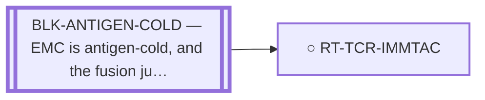

<!-- GENERATED FILE — DO NOT EDIT. Regenerate with:
     python3 systems/systems_check.py --write-views
     Source of truth: systems/graph/*.json -->

# RT-TCR-IMMTAC — Fusion-junction TCR-T / soluble-TCR (ImmTAC) against the junction peptide-HLA

**Family:** [ST-IMMUNO](L1-st-immuno.md) · **state:** ○ parked · concept · confidence low · verified 2026-08-05

**Grade** (owned by [`research/manuscripts/program/emc-post-degrader-options.md`](../../research/manuscripts/program/emc-post-degrader-options.md)): Tier 3 — the weak-junction-pHLA problem; EMC is antigen-cold

## What has to land for this route to move

**Reading it.** A solid arrow is what holds this route down today. A dashed arrow is a capability that WOULD retire a blocker — dashed because it has not landed, and the date beside it is a forecast, not a schedule.

⛔ **1 of these is permanent** (`BLK-ANTIGEN-COLD`) — a fact about the biology, drawn double-walled, with no way out by definition. No technology arrives to fix it.

✓ Already cleared by this route: `BLK-NOT-FUSION-SELECTIVE`, `BLK-PARALOGUE-DDG`, `BLK-TERNARY-GEOMETRY`.

## Scientific rationale

A soluble T-cell-receptor bispecific can reach a peptide-HLA that antibodies cannot, which is what makes an intracellular neoantigen targetable at all.

## Remaining unknowns

- Whether the junction peptide-HLA is strong enough — measurement says it is weak.
- Whether EMC's stroma admits T cells.

## Required validation

| what | instrument | feasible today | blocked by |
|---|---|---|---|
| A junction peptide-HLA strong enough to target | ⛔ none built | **no** | BLK-ANTIGEN-COLD |

## Blockers

| blocker | kind | what would retire it |
|---|---|---|
| **BLK-ANTIGEN-COLD** | `fundamental_biological_limit` | *permanent* |

## Blockers this route RETIRES

- **BLK-PARALOGUE-DDG** — The paralogue ΔΔG margin — selectivity that reduces to exp(−ΔΔG/RT)
- **BLK-TERNARY-GEOMETRY** — Ternary geometry — assembly, E3, exit vector, ubiquitin transfer
- **BLK-NOT-FUSION-SELECTIVE** — The route also engages the wild-type protein (NR4A3 LBD, or EWSR1's low-complexity half)

## Not to be confused with

| route | the axis it turns on | blockers the distinction turns on | why |
|---|---|---|---|
| [RT-PRAME-IMMTAC](L2-rt-prame-immtac.md) | which peptide the TCR sees | `BLK-ANTIGEN-COLD` | ⚠ BOTH ARE 'ImmTAC' AND THEY ARE NOT THE SAME ROUTE. This one targets the FUSION JUNCTION peptide-HLA (fusion-exclusive, weak junction). The PRAME route targets a cancer-testis antigen through an EXISTING tumour-agnostic basket product and is not fusion-exclusive at all |
| [RT-JUNCTION-NEOANTIGEN](L2-rt-junction-neoantigen.md) | antigen vs product | `BLK-NO-EMC-DATA` | this is one of three products on the same antigen |

## Readiness — what this could become today

**`internal_note`**

The weak-junction peptide-HLA is a measured property of this junction, not of the modality — so the route is blocked by its input rather than by its design.

**Missing:**
- a stronger presented epitope, and one not confined to a single allele — both corrected e7::e3 strong binders are HLA-B*15:01

## Where this route ends — the paper

**[PUB-NEOANTIGEN](L3-publications.md)** — [Targeting the EWSR1::NR4A3 fusion-junction neoantigen in extraskeletal myxoid chondrosarcoma: a fusion-exclusive immunot](../../research/manuscripts/neoantigen/fusion-junction-neoantigen-paper.md)

`contributing` · ◐ `drafted` · aimed at `preprint`

**This route contributes:** The receptor-side delivery option for the junction epitope, and the measured weakness of the junction peptide-HLA that bounds it — a property of this junction rather than of the modality.

**The paper would claim:** The fusion junction produces a peptide sequence that is absent from wild-type EWSR1 and wild-type NR4A3 — ⚠ the only novelty test in this repo compares against those two PARENT proteins (`fusion_breakpoints.py:231`) and NO proteome-wide search has ever been run, so 'absent from the normal proteome' is not a claim this work can make, and whether any allele presents it is a prediction that must be regenerated against a corrected exon index before it can be reported at all.

## Strategic timing — the wait equation

**Recommendation: `monitor`**

Waits on a measured property of the junction. No modality improvement changes a weak epitope.

| horizon | effect |
|---|---|
| Six months | None. |
| Two years | Only via better presentation prediction or a measured epitope. |
| Cost trend | flat |
| Automation outlook | Prediction is automated; the underlying biology is not. |

**Revisit when:**
- **TECH-JUNCTION-PMHC** — A fusion-junction presentation or immunogenicity predictor validated ON FUSION JUNCTIONS, or a TCR/ImmTAC discovery platform demon *(expected 2029, basis `extrapolated`)*

## Claim ceiling — what this route may NOT be used to claim

*Inherited from [ST-IMMUNO](L1-st-immuno.md), which is where these are asserted — a family limitation binds every route inside it.*

- EMC is antigen-cold and the fusion junction is a weak peptide-HLA — a property of this tumour and this junction, not of any modality here.
- Surface-antigen selectivity was measured on cell-line surrogates rather than on EMC tissue, so the negatives are as provisional as the positives would have been.
- One route's predicted binders span junction seams that a corrected exon index says do not exist; that result is void and the question is open.

## Closure

`premise_false` — The weak-junction peptide-HLA problem is a measured property of this junction, not of the modality.

## Best next action

Re-graded 2026-08-07: the epitopes changed (NMPCVQAQY / QQNMPCVQAQY) and the weak-junction finding holds.

*Cost:* $0

## What this route rests on — drill down

*L4 instruments and L5 objects, evidence and artifacts. Every row here is asserted by this route; the [evidence base](L5-evidence-base.md) shows the same edges from the other end.*

| L4 instrument | cited as | known-answer control |
|---|---|---|
| [INS-HLA-COVERAGE](registers/instruments.md) — HLA population-coverage calculator | **disclosed failing** | `none` |

**L5 objects:** [OBJ-MODEL-E7E3](L5-evidence-base.md#objects--the-biological-and-molecular-entities-the-program-reasons-about)

**L5 artifacts:** [ART-HLA-COVERAGE](L5-evidence-base.md#artifacts--the-files-a-claim-can-be-checked-against)

[← ST-IMMUNO](L1-st-immuno.md) · [← L0](L0-ecosystem.md)
