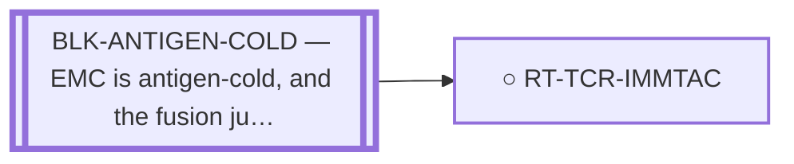

<!-- GENERATED FILE — DO NOT EDIT. Regenerate with:
     python3 systems/systems_check.py --write-views
     Source of truth: systems/graph/*.json -->

# RT-TCR-IMMTAC — Fusion-junction TCR-T / soluble-TCR (ImmTAC) against the junction peptide-HLA

**Family:** [ST-IMMUNO](L1-st-immuno.md) · **state:** ○ parked · concept · confidence low · verified 2026-08-05

**Grade** (owned by [`research/manuscripts/emc-post-degrader-options.md`](../../research/manuscripts/emc-post-degrader-options.md)): Tier 3 — the weak-junction-pHLA problem; EMC is antigen-cold

## What has to land for this route to move

**Reading it.** A solid arrow is what holds this route down today. A dashed arrow is a capability that WOULD retire a blocker — dashed because it has not landed, and the date beside it is a forecast, not a schedule.

⛔ **1 of these is permanent** (`BLK-ANTIGEN-COLD`) — a fact about the biology, drawn double-walled, with no way out by definition. No technology arrives to fix it.

✓ Already cleared by this route: `BLK-NOT-FUSION-SELECTIVE`, `BLK-PARALOGUE-DDG`, `BLK-TERNARY-GEOMETRY`.

## Scientific rationale

A soluble T-cell-receptor bispecific can reach a peptide-HLA that antibodies cannot, which is what makes an intracellular neoantigen targetable at all.

## Remaining unknowns

- Whether the junction peptide-HLA is strong enough — measurement says it is weak.
- Whether EMC's stroma admits T cells.

## Required validation

| what | instrument | feasible today | blocked by |
|---|---|---|---|
| A junction peptide-HLA strong enough to target | ⛔ none built | **no** | BLK-ANTIGEN-COLD |

## Blockers

| blocker | kind | what would retire it |
|---|---|---|
| **BLK-ANTIGEN-COLD** | `fundamental_biological_limit` | *permanent* |

## Blockers this route RETIRES

- **BLK-PARALOGUE-DDG** — The paralogue ΔΔG margin — selectivity that reduces to exp(−ΔΔG/RT)
- **BLK-TERNARY-GEOMETRY** — Ternary geometry — assembly, E3, exit vector, ubiquitin transfer
- **BLK-NOT-FUSION-SELECTIVE** — The route also engages the wild-type protein (NR4A3 LBD, or EWSR1's low-complexity half)

## Readiness — what this could become today

**`internal_note`**

The weak-junction peptide-HLA is a measured property of this junction, not of the modality — so the route is blocked by its input rather than by its design.

**Missing:**
- a stronger presented epitope

## Strategic timing — the wait equation

**Recommendation: `monitor`**

Waits on a measured property of the junction. No modality improvement changes a weak epitope.

| horizon | effect |
|---|---|
| Six months | None. |
| Two years | Only via better presentation prediction or a measured epitope. |
| Cost trend | flat |
| Automation outlook | Prediction is automated; the underlying biology is not. |

**Revisit when:**
- **TECH-EMC-EXPRESSION-DATA** — A fetchable public EMC RNA-seq or proteomics deposit beyond the single existing model, enabling a target-regulon readout and per-a *(expected 2029, basis `speculative`)*

## Closure

`premise_false` — The weak-junction peptide-HLA problem is a measured property of this junction, not of the modality.

## Best next action

Keep registered. Re-grade after the neoantigen predictions are regenerated.

*Cost:* $0

[← ST-IMMUNO](L1-st-immuno.md) · [← L0](L0-ecosystem.md)
