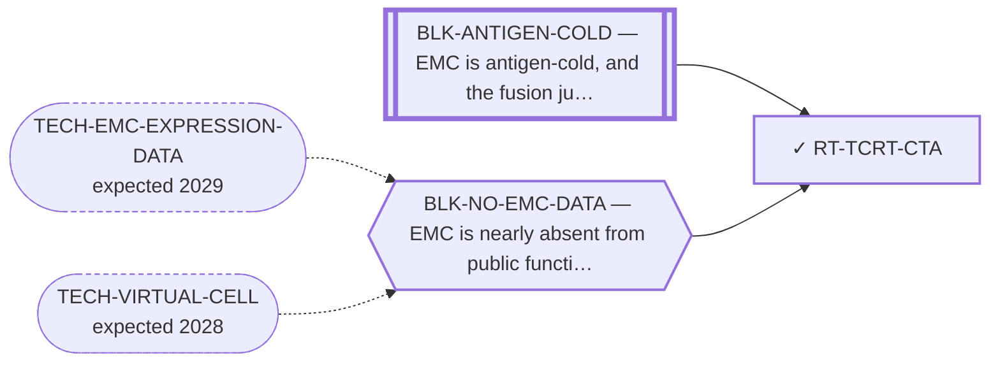

<!-- GENERATED FILE — DO NOT EDIT. Regenerate with:
     python3 systems/systems_check.py --write-views
     Source of truth: systems/graph/*.json -->

# RT-TCRT-CTA — TCR-T / engineered T cells vs a cancer-testis antigen (synovial-sarcoma port)

**Family:** [ST-IMMUNO](L1-st-immuno.md) · **state:** ✓ parked · computed · confidence moderate · verified 2026-09-19

**Grade** (owned by [`research/autonomy/cta-retained-tpm-20260919/RESULT.json`](../../research/autonomy/cta-retained-tpm-20260919/RESULT.json)): The fixed CTAG1B, MAGEA3 and SSX2 transcript lookup is complete in nine retained primary EMC specimens. Bulk reported TPM does not establish target-specific protein, peptide presentation, HLA eligibility or treatment coverage; no therapeutic regrade follows.

## What has to land for this route to move

**Reading it.** A solid arrow is what holds this route down today. A dashed arrow is a capability that WOULD retire a blocker — dashed because it has not landed, and the date beside it is a forecast, not a schedule.

⛔ **1 of these is permanent** (`BLK-ANTIGEN-COLD`) — a fact about the biology, drawn double-walled, with no way out by definition. No technology arrives to fix it.

✓ Already cleared by this route: `BLK-PARALOGUE-DDG`, `BLK-TERNARY-GEOMETRY`.

## Scientific rationale

The synovial-sarcoma precedent shows the approach works in a translocation sarcoma, and porting an approved approach is far cheaper than inventing one.

## Supporting evidence

| ref | supports | strength |
|---|---|---|
| `ART-CTA-EXPRESSION` | EMC is cancer-testis-antigen-low on the available measured data | `surrogate` |
| `ART-EMC-EXPRESSION-PANELS` | The older two-array and fourth assigned-gene-panel nonmeasurement is preserved. The separate fixed three-gene Hofvander lookup is now complete in research/autonomy/cta-retained-tpm-20260919/RESULT.json; it does not establish antigen presentation. | `direct` |

## Remaining unknowns

- Antigen-specific protein and cell-source evidence, peptide presentation and relevant HLA eligibility for any proposed intervention.
- Whether the released gene-labeled estimates uniquely distinguish the relevant homologs/isoforms for a specific target claim.

## Required validation

| what | instrument | feasible today | blocked by |
|---|---|---|---|
| Claim-specific gene/isoform identity, protein or peptide-presentation and HLA evidence. The fixed nine-specimen three-gene transcript lookup is complete. | ⛔ none built | **no** | — |

## Blockers

| blocker | kind | what would retire it |
|---|---|---|
| **BLK-ANTIGEN-COLD** | `fundamental_biological_limit` | *permanent* |
| **BLK-NO-EMC-DATA** | `insufficient_data` | `TECH-EMC-EXPRESSION-DATA`, `TECH-VIRTUAL-CELL` |

## Blockers this route RETIRES

- **BLK-PARALOGUE-DDG** — The paralogue ΔΔG margin — selectivity that reduces to exp(−ΔΔG/RT)
- **BLK-TERNARY-GEOMETRY** — Ternary geometry — assembly, E3, exit vector, ubiquitin transfer

## Not to be confused with

| route | the axis it turns on | blockers the distinction turns on | why |
|---|---|---|---|
| [RT-PRAME-IMMTAC](L2-rt-prame-immtac.md) | which CTA | `BLK-NO-EMC-DATA` | EMC is NY-ESO-1-rare and MAGE-A4-low on measured data; PRAME is separately expressed and separately graded |

## Readiness — what this could become today

**`internal_note`**

The source answers the limited bulk transcript lookup; treatment or population-coverage claims require distinct evidence.

**Missing:**
- Antigen-specific protein and cell-source evidence, peptide presentation and relevant HLA eligibility for any proposed intervention.
- Whether the released gene-labeled estimates uniquely distinguish the relevant homologs/isoforms for a specific target claim.

## Where this route ends — the paper

**[PUB-SURFACE-TARGETS](L3-publications.md)** — [CSPG4 tissue RNA enrichment in extraskeletal myxoid chondrosarcoma depends on comparator and sequencing year](../../research/manuscripts/surface-targets/emc-tissue-rna-prioritization.md)

`contributing` · ◉ `posted_preprint` · aimed at `journal_submission`

**This route contributes:** The cancer-testis antigen arm ported from synovial sarcoma, downgraded on a measurement rather than on an argument.

**The paper would claim:** A fixed panel of 11 therapeutic-address genes, with CHRNA6 as a separate established RNA-marker control, can be assessed using within-cohort tissue RNA ranks and prespecified sarcoma comparators. In the overlap-reduced Hofvander cohort of nine primary EMC specimens, CSPG4 alone meets the frozen tissue-validation allocation rule; its LGFMS contrast agrees with the original GSE24369 array contrast, but year-deletion sensitivity and DFSP context limit generalization. This supports a qualified rationale for EMC tissue protein and compartment validation, not validated surface expression, normal sparing, treatment selection or efficacy. All other fixed-panel results and discordant protein/normal-context evidence are retained.

## Strategic timing — the wait equation

**Recommendation: `wait`**

Do not repeat the completed TPM lookup. Reopen for a specific source-grounded antigen question that relevant evidence can answer.

| horizon | effect |
|---|---|
| Cost trend | flat |

**Revisit when:**
- **TECH-EMC-EXPRESSION-DATA** — A fetchable public EMC RNA-seq or proteomics deposit beyond the single existing model, enabling a target-regulon readout and per-a *(expected 2029, basis `speculative`)*

## Claim ceiling — what this route may NOT be used to claim

*Inherited from [ST-IMMUNO](L1-st-immuno.md), which is where these are asserted — a family limitation binds every route inside it.*

- EMC is antigen-cold and the fusion junction is a weak peptide-HLA — a property of this tumour and this junction, not of any modality here.
- Surface-antigen selectivity was measured on cell-line surrogates rather than on EMC tissue, so the negatives are as provisional as the positives would have been.
- One route's predicted binders span junction seams that a corrected exon index says do not exist; that result is void and the question is open.

## Closure

`instrument_limit` — Older platforms did not measure these three genes. A newer released gene-level TPM lookup is complete; a therapeutic conclusion remains limited by antigen identity/assignment, cell source, protein, presentation and eligibility.

## Best next action

Retain the nine-specimen CTAG1B/MAGEA3/SSX2 reported TPM table. Reopen for a defined antigen and compatible source/measurement resolving identity, cell source, protein, presentation or eligibility. No automatic therapeutic regrade from these RNA values.

*Cost:* $0 for bounded new evidence intake; no current analysis dispatch

## What this route rests on — drill down

*L4 instruments and L5 objects, evidence and artifacts. Every row here is asserted by this route; the [evidence base](L5-evidence-base.md) shows the same edges from the other end.*

| L4 instrument | cited as | known-answer control |
|---|---|---|
| [INS-HLA-COVERAGE](registers/instruments.md) — HLA population-coverage calculator | **disclosed failing** | `none` |

**L5 artifacts:** [ART-HLA-COVERAGE](L5-evidence-base.md#artifacts--the-files-a-claim-can-be-checked-against)

[← ST-IMMUNO](L1-st-immuno.md) · [← L0](L0-ecosystem.md)
