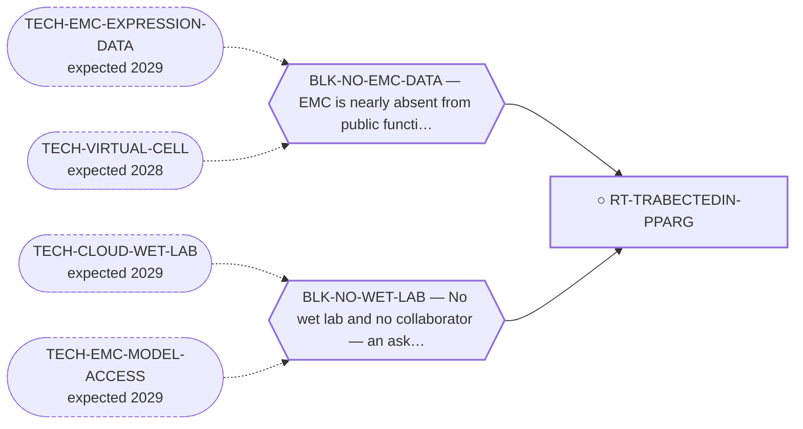

<!-- GENERATED FILE — DO NOT EDIT. Regenerate with:
     python3 systems/systems_check.py --write-views
     Source of truth: systems/graph/*.json -->

# RT-TRABECTEDIN-PPARG — Trabectedin + a PPARγ agonist (all approved drugs)

**Family:** [ST-REPURPOSING](L1-st-repurposing.md) · **state:** ○ blocked · concept · confidence low · verified 2026-08-05

**Grade** (owned by [`research/manuscripts/emc-post-degrader-options.md`](../../research/manuscripts/emc-post-degrader-options.md#route-6--trabectedin--a-ppar-agonist-an-all-approved-drug-combination-on-emcs-own-documented-axis)): Tier 2, rank 5 — ASK with a good taker and a thin deliverable

## What has to land for this route to move

**Reading it.** A solid arrow is what holds this route down today. A dashed arrow is a capability that WOULD retire a blocker — dashed because it has not landed, and the date beside it is a forecast, not a schedule.

✓ Already cleared by this route: `BLK-PARALOGUE-DDG`, `BLK-R4-BINDS`, `BLK-TERNARY-GEOMETRY`.

## Scientific rationale

Both components are approved, so a combination trial is unusually cheap to propose. The rationale is that the fusion engages PPARγ signalling, so an agonist might either cooperate with or antagonise the transcriptional interference trabectedin provides.

## Remaining unknowns

- The DIRECTION of the PPARγ effect in EMC is unresolved — if the fusion already turns PPARγ on, an agonist may be redundant or harmful.
- Whether the combination has any EMC-specific rationale beyond both drugs being available.

## Required validation

| what | instrument | feasible today | blocked by |
|---|---|---|---|
| An EMC expression read establishing the direction of PPARγ signalling | ⛔ none built | **no** | BLK-NO-EMC-DATA |
| A cell panel, which needs a bench | ⛔ none built | **no** | BLK-NO-WET-LAB |

## Blockers

| blocker | kind | what would retire it |
|---|---|---|
| **BLK-NO-WET-LAB** | `requires_external_collaboration` | `TECH-CLOUD-WET-LAB`, `TECH-EMC-MODEL-ACCESS` |
| **BLK-NO-EMC-DATA** | `insufficient_data` | `TECH-EMC-EXPRESSION-DATA`, `TECH-VIRTUAL-CELL` |

## Blockers this route RETIRES

- **BLK-PARALOGUE-DDG** — The paralogue ΔΔG margin — selectivity that reduces to exp(−ΔΔG/RT)
- **BLK-TERNARY-GEOMETRY** — Ternary geometry — assembly, E3, exit vector, ubiquitin transfer
- **BLK-R4-BINDS** — R4 — nothing is known to bind the cryptic pocket at all

## Readiness — what this could become today

**`experimental_proposal`**

The ask is well formed and both drugs are approved, but the direction of the PPARγ effect is unresolved — proposing a combination whose direction is unknown is a thin deliverable.

**Missing:**
- the direction of the PPARγ effect in EMC

## Strategic timing — the wait equation

**Recommendation: `wait`**

The single expression readout that settles the direction would either strengthen this proposal considerably or kill it. Asking a collaborator to run a combination whose direction we cannot state is a poor use of a scarce ask.

| horizon | effect |
|---|---|
| Six months | None unless data lands. |
| Two years | An EMC dataset would settle the direction and make the ask either strong or unnecessary. |
| Cost trend | flat |
| Automation outlook | The re-grade is automatic once data lands. |

**Revisit when:**
- **TECH-EMC-EXPRESSION-DATA** — A fetchable public EMC RNA-seq or proteomics deposit beyond the single existing model, enabling a target-regulon readout and per-a *(expected 2029, basis `speculative`)*

## Closure

`authorization` — Good taker, thin deliverable — the ask is the block.

## Best next action

Hold the ask until the PPARγ direction can be stated. Re-grade automatically when EMC expression data lands.

*Cost:* $0

[← ST-REPURPOSING](L1-st-repurposing.md) · [← L0](L0-ecosystem.md)
