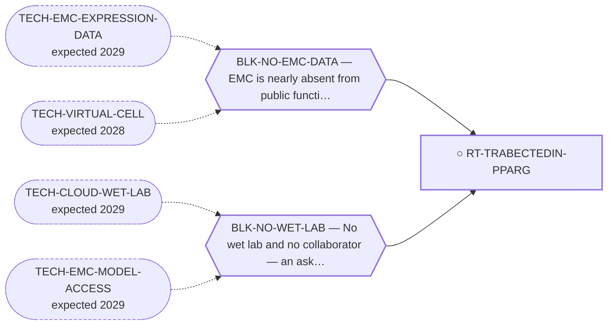

<!-- GENERATED FILE — DO NOT EDIT. Regenerate with:
     python3 systems/systems_check.py --write-views
     Source of truth: systems/graph/*.json -->

# RT-TRABECTEDIN-PPARG — Trabectedin + a PPARγ agonist (all approved drugs)

**Family:** [ST-REPURPOSING](L1-st-repurposing.md) · **state:** ○ blocked · concept · confidence low · verified 2026-08-28

**Grade** (owned by [`research/manuscripts/program/emc-post-degrader-options.md`](../../research/manuscripts/program/emc-post-degrader-options.md#route-6---trabectedin--a-pparγ-agonist-an-all-approved-drug-combination-on-emcs-own-documented-axis)): Tier 2, rank 5 — ASK with a good taker and a thin deliverable

## What has to land for this route to move

**Reading it.** A solid arrow is what holds this route down today. A dashed arrow is a capability that WOULD retire a blocker — dashed because it has not landed, and the date beside it is a forecast, not a schedule.

✓ Already cleared by this route: `BLK-PARALOGUE-DDG`, `BLK-R4-BINDS`, `BLK-TERNARY-GEOMETRY`.

## Scientific rationale

Both components are approved, so a combination trial is unusually cheap to propose. The rationale is that the fusion engages PPARγ signalling, so an agonist might either cooperate with or antagonise the transcriptional interference trabectedin provides.

## Supporting evidence

| ref | supports | strength |
|---|---|---|
| `ART-EMC-EXPRESSION-PANELS` | The EMC-tissue PPARγ activity read this route waited on. PPARγ target genes are coordinately higher in EMC tumour tissue than in comparator sarcomas beyond a size-matched random set, on both readable array platforms, with a knockout-UP falsifier arm carried alongside — AND the same data cannot separate that from an adipogenic differentiation programme, whose proxy is set-specific up on both platforms too and overlaps the occupancy-derived arm more than any other pair in the table. Most arms are mouse-derived, an orthology assumption carried into human transcripts. It says nothing about the direction of any pharmacological intervention on this axis. | `direct` |

## Remaining unknowns

- The DIRECTION of the PPARγ effect in EMC is unresolved — ⚠ but the redundancy clause ('if the fusion already turns PPARγ on, an agonist may be redundant or harmful') is WITHDRAWN: it is not in the source it cited, and Filion et al. propose agonists in their own discussion. Two primary studies answered the question in OPPOSITE directions; one functional experiment favours agonism, in a disputed-identity line. research/manuscripts/repurposing/pparg-direction-emc.md
- Whether the combination has any EMC-specific rationale beyond both drugs being available.
- The in-vivo evidence for agonism (Higuchi 2023) uses H-EMC-SS (OBJ-LINE-HEMCSS, identity disputed); whether the MOUSE experiment used that line is UNREAD — the paper is not open access and its full text has not been retrieved.

## Required validation

| what | instrument | feasible today | blocked by |
|---|---|---|---|
| An EMC expression read establishing the direction of PPARγ signalling — ✅ THE READ WAS TAKEN 2026-08-24 (research/manuscripts/fusion-output/nr4a3-fusion-transcriptional-output-SI.md §S4, from ART-EMC-EXPRESSION-PANELS reads.read_3_PPARG_ACTIVITY — that section owns every figure and none is restated here) AND IT DOES NOT ESTABLISH A DIRECTION. Recorded as answered-in-the-negative rather than outstanding, because leaving it open would keep this route waiting on data that has already arrived. | ⛔ none built | yes | — |
| A cell panel, which needs a bench | ⛔ none built | **no** | BLK-NO-WET-LAB |

## Blockers

| blocker | kind | what would retire it |
|---|---|---|
| **BLK-NO-WET-LAB** | `requires_external_collaboration` | `TECH-CLOUD-WET-LAB`, `TECH-EMC-MODEL-ACCESS` |
| **BLK-NO-EMC-DATA** | `insufficient_data` | `TECH-EMC-EXPRESSION-DATA`, `TECH-VIRTUAL-CELL` |

## Blockers this route RETIRES

- **BLK-PARALOGUE-DDG** — The paralogue ΔΔG margin — selectivity that reduces to exp(−ΔΔG/RT)
- **BLK-TERNARY-GEOMETRY** — Ternary geometry — assembly, E3, exit vector, ubiquitin transfer
- **BLK-R4-BINDS** — R4 — nothing is known to bind the cryptic pocket at all

## Not to be confused with

| route | the axis it turns on | blockers the distinction turns on | why |
|---|---|---|---|
| [RT-TRABECTEDIN](L2-rt-trabectedin.md) | combination vs monotherapy | `BLK-NO-WET-LAB` | the board carried trabectedin and the PPARG axis as two separate rows for months and never joined them; joining them is what created THIS route, and the monotherapy row remains a distinct near-term lead with its own evidence |
| [RT-PPARG-DOWNSTREAM](L2-rt-pparg-downstream.md) | whether the agonist acts alone | `BLK-NO-EMC-DATA` | the downstream/TZD row is the agonist ALONE and carries an unresolved direction question that cuts AGAINST the naive version — in EMC the fusion turns PPARG on, so an agonist may be redundant. The combination's logic is promoter displacement unmasking a differentiation-competent receptor, which is a different argument |
| [RT-RXR](L2-rt-rxr.md) | which receptor's dimer is being modulated | `BLK-NO-EMC-DATA` | same scoping — the closed dimer is NR4A3:RXR, not the PPARγ:RXR axis this route's agonist half acts on |

## Readiness — what this could become today

**`experimental_proposal`**

The ask is well formed and both drugs are approved, but the direction of the PPARγ effect is unresolved — proposing a combination whose direction is unknown is a thin deliverable.

**Missing:**
- a DIRECTION for the PPARγ effect, which the activity read did not supply — it is stated at T1 with a model-identity caveat in research/manuscripts/repurposing/pparg-direction-emc.md §6, unmoved by §6a
- a cell panel, which needs a bench

## Where this route ends — the paper

**[PUB-REPURPOSING](L3-publications.md)** — [Existing drugs not yet reported in extraskeletal myxoid chondrosarcoma: a graded candidate menu from three independent generation methods](../../research/manuscripts/repurposing/repurposing-hypotheses.md)

`contributing` · ◐ `drafted` · aimed at `preprint`

**This route contributes:** The all-approved combination arm, held behind the same unresolved PPARγ direction that bounds the row above it.

**The paper would claim:** Existing agents not yet reported in EMC can be mapped to EMC's molecular and microenvironmental axes by three independent methods, each candidate graded by an explicit evidence tier — a hypothesis-generating menu that asserts no efficacy for any agent it names.

## Strategic timing — the wait equation

**Recommendation: `wait`**

⚠ SUPERSEDED, RETAINED: 'The single expression readout that settles the direction would either strengthen this proposal considerably or kill it.' The readout was taken and did neither. Asking a collaborator to run a combination whose direction we still cannot state remains a poor use of a scarce ask.

| horizon | effect |
|---|---|
| Six months | None unless data lands. |
| Two years | ⚠ SUPERSEDED, RETAINED: 'An EMC dataset would settle the direction'. One arrived and did not. |
| Cost trend | flat |
| Automation outlook | The re-grade is automatic once data lands. |

**Revisit when:**
- **TECH-EMC-EXPRESSION-DATA** — A fetchable public EMC RNA-seq or proteomics deposit beyond the single existing model, enabling a target-regulon readout and per-a *(expected 2029, basis `speculative`)*

## Claim ceiling — what this route may NOT be used to claim

*Inherited from [ST-REPURPOSING](L1-st-repurposing.md), which is where these are asserted — a family limitation binds every route inside it.*

- EMC is nearly absent from public functional-genomics data, so mechanism fit is argued from class membership rather than measured in this disease.
- Several routes here rest on a direction of effect that has never been read in EMC tissue; an expression readout would settle them cheaply and does not exist.
- A repurposing hypothesis is a hypothesis. Nothing here asserts efficacy in EMC.

## Closure

`authorization` — Good taker, thin deliverable — the ask is the block. ⭐ 2026-08-28: the expression read this route was waiting on has been taken and does not establish the direction (research/manuscripts/fusion-output/nr4a3-fusion-transcriptional-output-SI.md §S4, from ART-EMC-EXPRESSION-PANELS reads.read_3_PPARG_ACTIVITY — that section owns every figure and none is restated here). The ask is still the block, and it is now an ask made without the direction, not an ask waiting for it.

## Best next action

Hold the ask until the PPARγ direction can be stated. Re-grade automatically when EMC expression data lands.

*Cost:* $0

## What this route rests on — drill down

*L4 instruments and L5 objects, evidence and artifacts. Every row here is asserted by this route; the [evidence base](L5-evidence-base.md) shows the same edges from the other end.*

**L5 objects:** [OBJ-FUS-T1](L5-evidence-base.md#objects--the-biological-and-molecular-entities-the-program-reasons-about)

**L5 evidence:** [EV-FILION-2009](L5-evidence-base.md#evidence--the-literature-this-program-cites), [EV-HIGUCHI-2023](L5-evidence-base.md#evidence--the-literature-this-program-cites), [EV-PIOGLITAZONE-TRABECTEDIN-2019](L5-evidence-base.md#evidence--the-literature-this-program-cites), [EV-SUBRAMANIAN-2005](L5-evidence-base.md#evidence--the-literature-this-program-cites)

**L5 artifacts:** [ART-EMC-EXPRESSION-PANELS](L5-evidence-base.md#artifacts--the-files-a-claim-can-be-checked-against)

[← ST-REPURPOSING](L1-st-repurposing.md) · [← L0](L0-ecosystem.md)
