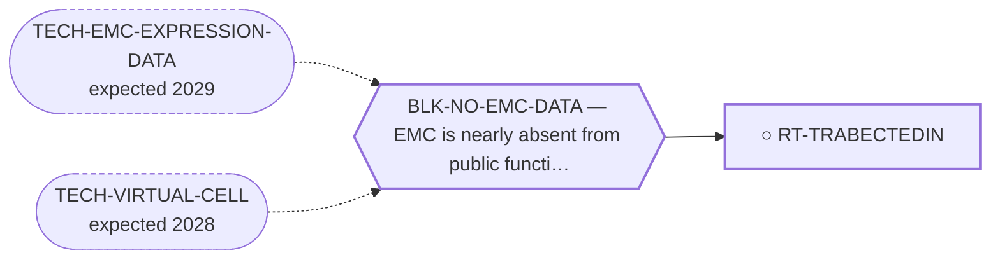

<!-- GENERATED FILE — DO NOT EDIT. Regenerate with:
     python3 systems/systems_check.py --write-views
     Source of truth: systems/graph/*.json -->

# RT-TRABECTEDIN — Trabectedin (± RT or combination)

**Family:** [ST-REPURPOSING](L1-st-repurposing.md) · **state:** ○ ready · concept · confidence low · verified 2026-08-05

**Grade** (owned by [`research/IDEAS.md`](../../research/IDEAS.md)): NEAR-TERM LEAD — approved, mechanism-fit

## What has to land for this route to move

**Reading it.** A solid arrow is what holds this route down today. A dashed arrow is a capability that WOULD retire a blocker — dashed because it has not landed, and the date beside it is a forecast, not a schedule.

✓ Already cleared by this route: `BLK-PARALOGUE-DDG`, `BLK-TERNARY-GEOMETRY`.

## Scientific rationale

Trabectedin is approved and used in sarcoma, and this repo's clinical registry records DISEASE CONTROL in EMC — n=5, secondary provenance, median PFS ~12.5 months, mostly stable disease, with NO response rate recorded. ⚠ The single 'impressive response' in the literature is a RADIOTHERAPY + trabectedin case, so it does not support this route, whose alias is trabectedin MONOTHERAPY. No efficacy, safety, eligibility or clinical-readiness claim is made for EMC.

## Supporting evidence

| ref | supports | strength |
|---|---|---|
| `ART-EMC-CLINICAL-REGISTRY` | a 5-patient SECONDARY-provenance series reporting disease control (median PFS ~12.5 months, mostly stable disease); no response rate is recorded, and the registry's own intro says cytotoxic chemotherapy mainly stabilises disease | `transferred` |

## Remaining unknowns

- Whether the mechanistic fit is real or a post-hoc story fitted to a single response.
- How the agent interacts with the fusion's specific programme, which has never been measured in EMC.
- The '± RT' half of this route is unaddressed, and the only impressive-response case is an RT COMBINATION — the registry records radiotherapy in localized EMC as `contested` and adjuvant chemotherapy as `consensus-against`.

## Required validation

| what | instrument | feasible today | blocked by |
|---|---|---|---|
| A larger EMC series, or a measured effect on the fusion's transcriptional output | ⛔ none built | **no** | BLK-NO-EMC-DATA |

## Blockers

| blocker | kind | what would retire it |
|---|---|---|
| **BLK-NO-EMC-DATA** | `insufficient_data` | `TECH-EMC-EXPRESSION-DATA`, `TECH-VIRTUAL-CELL` |

## Blockers this route RETIRES

- **BLK-PARALOGUE-DDG** — The paralogue ΔΔG margin — selectivity that reduces to exp(−ΔΔG/RT)
- **BLK-TERNARY-GEOMETRY** — Ternary geometry — assembly, E3, exit vector, ubiquitin transfer

## Not to be confused with

| route | the axis it turns on | blockers the distinction turns on | why |
|---|---|---|---|
| [RT-TRABECTEDIN-PPARG](L2-rt-trabectedin-pparg.md) | combination vs monotherapy | `BLK-NO-EMC-DATA` | monotherapy rests on a disease-control series, NOT on the RT-combination responder case and a mechanism fit; the combination rests additionally on a published result in a sibling sarcoma and on the fusion→PPARG axis |
| [RT-CARFILZOMIB](L2-rt-carfilzomib.md) | unbiased screen hit vs mechanism-fit argument | `BLK-NO-EMC-DATA` | trabectedin is argued from mechanism fit plus a clinical disease-control series; carfilzomib is an empirical ex-vivo screen hit with no fusion rationale |
| [RT-HDAC-BET](L2-rt-hdac-bet.md) | whether the closure is about molecular selectivity or about clinical activity | `BLK-CLASS-INHERITANCE` | this route stays live because its claim is clinical activity; RT-HDAC-BET is closed only on the fusion-SELECTIVITY claim, and both are chromatin-acting and neither is molecularly fusion-selective |

## Readiness — what this could become today

**`internal_note`**

This is clinical-evidence synthesis rather than a computational contribution. It belongs as landscape context in a paper, not as a result.

**Missing:**
- a larger clinical series

## Where this route ends — the paper

**[PUB-EMC-PROGRAM](L3-publications.md)** — [Attacking an "undruggable" fusion oncoprotein by computation alone: a driver-directed treatment program for EWSR1::NR4A3](../../research/manuscripts/program/emc-treatment-roadmap.md)

`context` · ◐ `drafted` · aimed at `journal_submission`

**This route contributes:** Cited to establish current care and the categorical gap. Explicitly not this program's contribution — it is clinical-evidence synthesis, and a single response must not be overstated.

**The paper would claim:** The gap in EMC care is categorical rather than a matter of degree — nothing in clinical use addresses the driver — and a computation-only program can enumerate the driver-directed routes, state a falsifiable kill criterion for each, and place the borrowed standard-of-care agents as context rather than as its own contribution.

## Strategic timing — the wait equation

**Recommendation: `monitor`**

Nothing computational advances it. Its role is as the near-term comparator any new route has to beat, which is a role it plays without further work.

| horizon | effect |
|---|---|
| Six months | Only via new clinical reports. |
| Two years | Same. |
| Cost trend | flat |
| Automation outlook | Literature monitoring is already automated. |

**Revisit when:**
- **TECH-EMC-EXPRESSION-DATA** — A fetchable public EMC RNA-seq or proteomics deposit beyond the single existing model, enabling a target-regulon readout and per-a *(expected 2029, basis `speculative`)*

## Claim ceiling — what this route may NOT be used to claim

*Inherited from [ST-REPURPOSING](L1-st-repurposing.md), which is where these are asserted — a family limitation binds every route inside it.*

- EMC is nearly absent from public functional-genomics data, so mechanism fit is argued from class membership rather than measured in this disease.
- Several routes here rest on a direction of effect that has never been read in EMC tissue; an expression readout would settle them cheaply and does not exist.
- A repurposing hypothesis is a hypothesis. Nothing here asserts efficacy in EMC.

## Best next action

Keep as cited landscape context. Do not overstate a single response.

*Cost:* $0

## What this route rests on — drill down

*L4 instruments and L5 objects, evidence and artifacts. Every row here is asserted by this route; the [evidence base](L5-evidence-base.md) shows the same edges from the other end.*

**L5 objects:** [OBJ-FUS-T1](L5-evidence-base.md#objects--the-biological-and-molecular-entities-the-program-reasons-about)

[← ST-REPURPOSING](L1-st-repurposing.md) · [← L0](L0-ecosystem.md)
