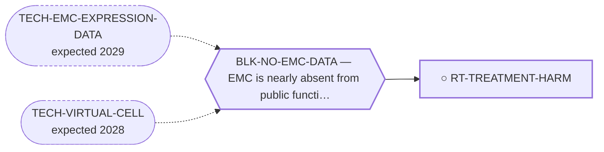

<!-- GENERATED FILE — DO NOT EDIT. Regenerate with:
     python3 systems/systems_check.py --write-views
     Source of truth: systems/graph/*.json -->

# RT-TREATMENT-HARM — De-escalating cytotoxic therapy that has no measured EMC response

**Family:** [ST-MORTALITY-MECHANISM](L1-st-mortality-mechanism.md) · **state:** ○ ready · concept · confidence low · verified 2026-08-09

**Grade** (owned by [`research/manuscripts/emc-mortality-mechanisms.md`](../../research/manuscripts/emc-mortality-mechanisms.md)): ⭑ Registered 2026-08-09 from trimcrae's mechanism-of-death question; the family this route sits in did not exist before that day.

## What has to land for this route to move

**Reading it.** A solid arrow is what holds this route down today. A dashed arrow is a capability that WOULD retire a blocker — dashed because it has not landed, and the date beside it is a forecast, not a schedule.

## Scientific rationale

This is the only route in the portfolio whose intervention is subtraction. The curated record reports that chemotherapy produced no objective responses in one long-term series, with a median progression-free survival of about five months, while the toxicities of that same therapy -- anthracycline cardiotoxicity over a decade-scale survivorship, and neutropenic sepsis acutely -- are real and well characterised. A treatment with no measured benefit in this histology and a measurable hazard is a candidate for removal on survival grounds, not merely on quality-of-life grounds.

## Remaining unknowns

- What fraction of deaths in the published EMC record is attributable to treatment rather than to disease, which nobody has counted.
- Whether the absence of objective responses in the curated series generalises, given how small every EMC cohort is and how strongly they are selected.
- Whether anthracycline exposure in this specific long-surviving population produces the late cardiac mortality the class is known for, which would need cardio-oncology follow-up nobody has published for this histology.

## Required validation

| what | instrument | feasible today | blocked by |
|---|---|---|---|
| A count of treatment-attributed deaths in the retrieved terminal-event corpus, separated from disease deaths | ⛔ none built | yes | — |
| Late cardiac outcome data in anthracycline-exposed EMC survivors, which requires a clinical cohort | ⛔ none built | **no** | BLK-NO-EMC-DATA, BLK-NO-WET-LAB |

## Blockers

| blocker | kind | what would retire it |
|---|---|---|
| **BLK-NO-EMC-DATA** | `insufficient_data` | `TECH-EMC-EXPRESSION-DATA`, `TECH-VIRTUAL-CELL` |

## Readiness — what this could become today

**`internal_note`**

Registered 2026-08-09 at concept maturity; the honest output today is the question and its cheapest next observation.

## Where this route ends — the paper

**[PUB-MORTALITY-MECHANISM](L3-publications.md)** — *What actually kills people with extraskeletal myxoid chondrosarcoma, and the share of it no targeted therapy addresses* (unwritten)

`contributing` · ◔ `outlined` · aimed at `preprint`

**This route contributes:** The uncomfortable half of the argument: that part of the mortality this portfolio is trying to reduce may be iatrogenic, and that the cheapest intervention is to stop.

**The paper would claim:** In extraskeletal myxoid chondrosarcoma a large share of the deaths that follow diagnosis are not caused by the tumour, so the ceiling on the entire antitumour portfolio is a bounded number of percentage points of overall survival rather than an open-ended one -- and the remaining deaths, which no targeted route addresses, fall to mechanisms ordinary medicine already treats.

**It is not written because:** The mechanism half rests on a terminal-event corpus that is being retrieved but has not yet been read, and until each mechanism resolves to a quoted sentence the paper would be asserting a cause-of-death breakdown from a plausible story about an indolent tumour. The decomposition half is computed and holds; the two are not publishable separately, because a ceiling without a mechanism is a statistic and a mechanism without a ceiling is an anecdote.

## Strategic timing — the wait equation

**Recommendation: `pursue_now`**

The counting needs only the corpus already being retrieved, and a route whose intervention is subtraction has no cost to model and no supply chain to wait for.

| horizon | effect |
|---|---|
| Cost trend | flat |

## Claim ceiling — what this route may NOT be used to claim

*Inherited from [ST-MORTALITY-MECHANISM](L1-st-mortality-mechanism.md), which is where these are asserted — a family limitation binds every route inside it.*

- The competing-mortality figure is arithmetic on published summary percentages from heterogeneous studies, not a competing-risks model, and most pairings cross populations.
- Every supportive-care effect size available to this family was measured in some other cancer; no EMC-specific supportive-care outcome data exists at all.
- Nothing in this family asserts efficacy, safety, a therapeutic window or clinical readiness, and a mechanism being common is not evidence that treating it changes survival.

## Best next action

Count treatment-attributed deaths in the terminal-event corpus and set them beside the curated response data for the same agents.

*Cost:* $0

[← ST-MORTALITY-MECHANISM](L1-st-mortality-mechanism.md) · [← L0](L0-ecosystem.md)
