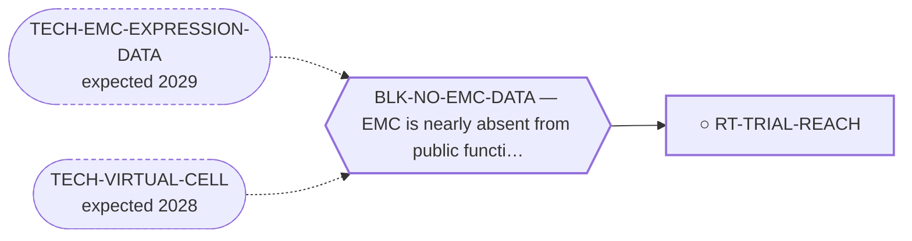

<!-- GENERATED FILE — DO NOT EDIT. Regenerate with:
     python3 systems/systems_check.py --write-views
     Source of truth: systems/graph/*.json -->

# RT-TRIAL-REACH — Trial reachability and access pathways

**Family:** [ST-STRATEGY](L1-st-strategy.md) · **state:** ○ blocked · concept · confidence low · verified 2026-08-09

**Grade** (owned by [`research/manuscripts/cancer-modality-census.md`](../../research/manuscripts/cancer-modality-census.md#36--strategy-and-reachability)): ⭑ Registered 2026-08-09 from the modality census, porting a 2026-08-07 lane and adding the access-pathway half, which closes a gap in the portfolio's own logic.

## What has to land for this route to move

**Reading it.** A solid arrow is what holds this route down today. A dashed arrow is a capability that WOULD retire a blocker — dashed because it has not landed, and the date beside it is a forecast, not a schedule.

## Scientific rationale

Two findings meet here. A trial exists whose eligibility is defined by the fusion family this disease belongs to while its listed conditions do not name the disease, so no histology-based search reaches it — a reachability problem, and reachability is something a paper can fix. And the portfolio names publication as its endpoint everywhere while never registering the mechanism by which a published hypothesis becomes a treated patient, which leaves the chain from result to patient with a missing link nobody owns.

## Remaining unknowns

- How many trials define eligibility molecularly while listing conditions histologically, which nobody has swept for.
- Whether any of this portfolio's candidates could in principle enter a single-patient access pathway, which depends on regulatory facts this program has never assessed.

## Required validation

| what | instrument | feasible today | blocked by |
|---|---|---|---|
| The $0 analysis or registry sweep named in this route's next action | ⛔ none built | yes | — |
| Prospective confirmation, which no trial in this disease will supply | ⛔ none built | **no** | BLK-NO-WET-LAB |

## Blockers

| blocker | kind | what would retire it |
|---|---|---|
| **BLK-NO-EMC-DATA** | `insufficient_data` | `TECH-EMC-EXPRESSION-DATA`, `TECH-VIRTUAL-CELL` |

## Readiness — what this could become today

**`preprint`**

Nothing has been run. This route was registered on 2026-08-09 from the modality census and is at concept maturity, so the only honest output today is the question and its cheapest next observation.

**Missing:**
- the registry sweep for molecularly-defined eligibility, which is a free CI job

## Where this route ends — the paper

**[PUB-STRATEGY-ARCH](L3-publications.md)** — *Scheduling, sequencing and reachability as treatment variables in an ultra-rare cancer* (unwritten)

`contributing` · ○ `unwritten` · aimed at `preprint`

**This route contributes:** One of the variables a clinician actually controls in a cancer that will never have a randomised trial — when, in what order, and whether the patient can reach anything.

**The paper would claim:** For a cancer that will never have a randomised trial, the variables a clinician actually controls — when, in what order, and whether the patient can reach a trial at all — are treatable as research questions, and a portfolio whose every endpoint is a publication needs the step after publication registered as a route.

**It is not written because:** Three of its four routes have not had their $0 analyses run, and the fourth is a registry sweep that has not been performed.

## Strategic timing — the wait equation

**Recommendation: `pursue_now`**

The next step costs nothing and needs nobody's cooperation, so there is no reason to defer it; what it returns decides whether this route is worth more than a row.

| horizon | effect |
|---|---|
| Cost trend | flat |

## Claim ceiling — what this route may NOT be used to claim

*Inherited from [ST-STRATEGY](L1-st-strategy.md), which is where these are asserted — a family limitation binds every route inside it.*

- Nothing in this family produces a new agent, so the ceiling of every route here is bounded by what the existing agents can do.
- Scheduling and sequencing questions are normally settled by randomised trials, and this disease will not have one — so every route here ends in a modelled or observational argument whose limits must travel with it.
- The reachability routes act on institutions rather than on biology, which is a domain where this program has no track record and where a wrong answer is not falsifiable by computation.
- Nothing in this family asserts efficacy, safety, a therapeutic window or clinical readiness.

## Best next action

Sweep the trial registries for eligibility criteria naming fusion families rather than histologies, and map the access pathways and outcome registries that accept single-patient reports.

*Cost:* $0

[← ST-STRATEGY](L1-st-strategy.md) · [← L0](L0-ecosystem.md)
