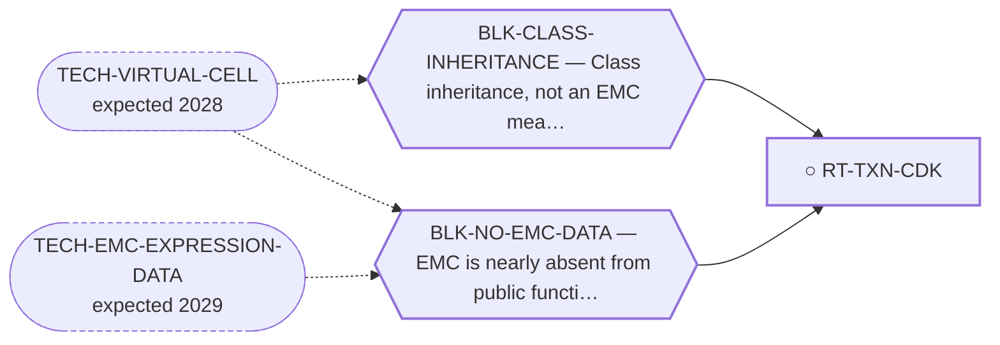

<!-- GENERATED FILE — DO NOT EDIT. Regenerate with:
     python3 systems/systems_check.py --write-views
     Source of truth: systems/graph/*.json -->

# RT-TXN-CDK — Transcriptional CDK dependency (CDK7, CDK9, CDK12/13)

**Family:** [ST-DEPENDENCY](L1-st-dependency.md) · **state:** ○ blocked · concept · confidence low · verified 2026-08-09

**Grade** (owned by [`research/manuscripts/cancer-modality-census.md`](../../research/manuscripts/cancer-modality-census.md#31--transcriptional-and-proteostatic-dependency)): ⭑ Registered 2026-08-09 from the modality census as its largest never-searched gap; concept maturity, nothing run.

## What has to land for this route to move

**Reading it.** A solid arrow is what holds this route down today. A dashed arrow is a capability that WOULD retire a blocker — dashed because it has not landed, and the date beside it is a forecast, not a schedule.

## Scientific rationale

The driver acts by transactivating target promoters, and transcriptional CDK dependency is the best-established vulnerability of fusion-driven sarcomas as a class. The census found no route, no prior sweep and no technique-class table here had ever named it, which makes this the largest single gap in the class the portfolio should most obviously have covered.

## Remaining unknowns

- Whether the dependency is greater in the tumour than in the host cell, which is the entire question and is not answered by any published sarcoma result.
- Whether a transfer from other fusion-driven sarcomas holds for a nuclear-receptor fusion, which is a different transcription-factor class from the ETS and bZIP fusions the class prior is built on.

## Required validation

| what | instrument | feasible today | blocked by |
|---|---|---|---|
| A class-inheritance argument over the transcriptional CDKs using the sarcoma dependency prior already committed here | ⛔ none built | yes | — |
| A measurement in a fusion-positive EMC model | ⛔ none built | **no** | BLK-NO-WET-LAB, BLK-NO-EMC-DATA |

## Blockers

| blocker | kind | what would retire it |
|---|---|---|
| **BLK-CLASS-INHERITANCE** | `insufficient_data` | `TECH-VIRTUAL-CELL` |
| **BLK-NO-EMC-DATA** | `insufficient_data` | `TECH-EMC-EXPRESSION-DATA`, `TECH-VIRTUAL-CELL` |

## Readiness — what this could become today

**`internal_note`**

Nothing has been run. This route was registered on 2026-08-09 from the modality census and is at concept maturity, so the only honest output today is the question and its cheapest next observation.

**Missing:**
- the class-inheritance analysis, which is $0 and has not been run

## Where this route ends — the paper

**[PUB-TXN-DEPENDENCY](L3-publications.md)** — *Transcriptional and proteostatic dependency of a fusion transcription factor: what a no-wet-lab program can and cannot establish* (unwritten)

`primary` · ○ `unwritten` · aimed at `preprint`

**This route contributes:** The half of the paper that argues from what the driver IS: a transcriptional oncoprotein should be more dependent on the transcriptional machinery than the cell it sits in.

**The paper would claim:** A fusion oncoprotein whose entire mechanism is transactivation, and whose structure is a chimera of two domains that never evolved together, predicts dependencies on the transcriptional machinery and on the chaperone system — and neither had ever been assessed in this disease despite both being standard vulnerabilities of its tumour class.

**It is not written because:** The two classes it would cover were identified on 2026-08-09 and neither has had its cheapest observation yet, so there is no result to write up — only a stated gap and a protocol for closing it.

## Strategic timing — the wait equation

**Recommendation: `pursue_now`**

The next step costs nothing and needs nobody's cooperation, so there is no reason to defer it; what it returns decides whether this route is worth more than a row.

| horizon | effect |
|---|---|
| Cost trend | flat |

## Claim ceiling — what this route may NOT be used to claim

*Inherited from [ST-DEPENDENCY](L1-st-dependency.md), which is where these are asserted — a family limitation binds every route inside it.*

- The dependency transfer prior came back negative on the available data — a measured premise, revivable only by EMC-specific data.
- One route rests on class inheritance: no NR4A3 fusion has been tested for the phenotype it assumes.
- There is one EMC model in public dependency data, with no CRISPR data, so this family's in-silico half is bounded by a sample size of one.

## Best next action

Run the same class-inheritance analysis already built for the DNA-damage-response lane over the transcriptional CDKs, and report it as a transfer with no EMC line in it.

*Cost:* $0

[← ST-DEPENDENCY](L1-st-dependency.md) · [← L0](L0-ecosystem.md)
