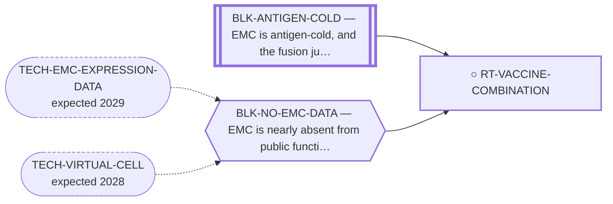

<!-- GENERATED FILE — DO NOT EDIT. Regenerate with:
     python3 systems/systems_check.py --write-views
     Source of truth: systems/graph/*.json -->

# RT-VACCINE-COMBINATION — Junction vaccine on a checkpoint and antiangiogenic backbone

**Family:** [ST-IMMUNO](L1-st-immuno.md) · **state:** ○ blocked · concept · confidence low · verified 2026-08-19

**Grade** (owned by [`research/manuscripts/neoantigen/emc-vaccine-development-path.md`](../../research/manuscripts/neoantigen/emc-vaccine-development-path.md#4-an-ungraded-combination)): REGISTERED 2026-08-19 AS AN UNGRADED UNIT, NOT AS A PROMOTION. Every component was graded alone and each exclusion assumed the others absent.

## What has to land for this route to move

**Reading it.** A solid arrow is what holds this route down today. A dashed arrow is a capability that WOULD retire a blocker — dashed because it has not landed, and the date beside it is a forecast, not a schedule.

⛔ **1 of these is permanent** (`BLK-ANTIGEN-COLD`) — a fact about the biology, drawn double-walled, with no way out by definition. No technology arrives to fix it.

## Scientific rationale

The priming-directed classes were excluded for this disease on the ground that a quiet genome supplies too few antigens; the junction vaccine was parked on the ground that a cold tumour supplies too little priming. Each verdict assumed the other component absent, and no evaluation of the combination exists. A checkpoint and antiangiogenic backbone with a reported EMC histology-specific cohort already exists, and the antiangiogenic arm bears on the physical exclusion that the vaccine cannot address.

## Supporting evidence

| ref | supports | strength |
|---|---|---|
| `ART-EMC-CLINICAL-REGISTRY` | a histology-specific EMC cohort of sunitinib plus nivolumab reporting 16 of 23 evaluable patients progression-free at 6 months and median PFS 13.2 months; conference abstract, single-arm, not peer-reviewed | `transferred` |

## Remaining unknowns

- Whether any junction peptide is presented on EMC tissue at all, which bounds the whole route.
- Whether the novel seam residues fall at anchor positions or at T-cell-receptor contact positions.
- Whether EMC retains HLA class I expression, which is unmeasured in this disease.
- Whether the reported backbone activity is attributable to the immune arm or to the tyrosine kinase inhibitor.

## Required validation

| what | instrument | feasible today | blocked by |
|---|---|---|---|
| Proteome-wide novelty of the junction peptides | ⛔ none built | yes | — |
| Anchor-versus-contact-position analysis of the seam residues | ⛔ none built | yes | — |
| Immunopeptidomics on EMC tissue or a patient-derived line | ⛔ none built | **no** | BLK-NO-EMC-DATA |
| T-cell reactivity against identified peptide-HLA complexes | ⛔ none built | **no** | BLK-ANTIGEN-COLD, BLK-NO-EMC-DATA |

## Blockers

| blocker | kind | what would retire it |
|---|---|---|
| **BLK-ANTIGEN-COLD** | `fundamental_biological_limit` | *permanent* |
| **BLK-NO-EMC-DATA** | `insufficient_data` | `TECH-EMC-EXPRESSION-DATA`, `TECH-VIRTUAL-CELL` |

## Not to be confused with

| route | the axis it turns on | blockers the distinction turns on | why |
|---|---|---|---|
| [RT-VACCINE](L2-rt-vaccine.md) | unit of evaluation | `BLK-ANTIGEN-COLD` | RT-VACCINE is the vaccine as a standalone product and is parked on immunogenicity. This route is the combination, in which the vaccine supplies antigen and the backbone supplies priming and access; the parking argument for one is not an argument about the other |

## Readiness — what this could become today

**`preprint`**

Nothing here is measured in EMC. The deliverable is a development path with explicit falsifiers, and its own headline figures bound the addressable fraction near 30%.

**Missing:**
- the Stage 0 computational items
- any EMC tissue result

## Where this route ends — the paper

**[PUB-VACCINE-PATH](L3-publications.md)** — [A fusion-junction vaccine in extraskeletal myxoid chondrosarcoma: what can be established today, and the capabilities that would change it](../../research/manuscripts/neoantigen/emc-vaccine-development-path.md)

`primary` · ◐ `drafted` · aimed at `preprint`

**This route contributes:** The blocker ledger, the staged path and the explicit falsifiers, plus the observation that the standing negative was reached by grading the vaccine alone.

**The paper would claim:** That the obstacles between the EWSR1::NR4A3 junction and a therapeutic vaccine are separable and individually falsifiable, and that several of the figures the route has been graded on are properties of the screen rather than of the tumour: predicted class I coverage moves with the allele panel and moves to zero at a 0.125-unit change in an undefended acceptance threshold. It reports two results — that seam-proximal peptides of four of the five in-frame junctions reproduce a normal NR4A3 isoform sequence, withdrawing one predicted binder and exposing an isoform-blind novelty filter; and that the class II arm is negative on the three DRB1 alleles tested while bounding the general availability of helper epitopes hardly at all. It also observes, of this programme's own route ledger and not of the field, that several priming-directed classes were excluded for want of antigen supply while a vaccine is an antigen supply, so the combination was never graded here as a unit. No efficacy, safety, presentation or immunogenicity claim is made.

## Strategic timing — the wait equation

**Recommendation: `pursue_now`**

Its Stage 0 items are computational, cost nothing, and three of them can close the route outright, which is the correct order for a route whose expensive steps need tissue this programme does not have. It waits on no external capability: what gates it is a measurement on EMC material, not a technology that does not yet exist.

| horizon | effect |
|---|---|
| Six months | None; the free items are available now. |
| Two years | Presentation prediction and pMHC discovery platforms are improving, which bears on Stage 2. |
| Cost trend | flat |
| Automation outlook | Stage 0 is fully automatable; Stages 1 to 3 are not computational. |

## Claim ceiling — what this route may NOT be used to claim

*Inherited from [ST-IMMUNO](L1-st-immuno.md), which is where these are asserted — a family limitation binds every route inside it.*

- EMC is antigen-cold and the fusion junction is a weak peptide-HLA — a property of this tumour and this junction, not of any modality here.
- Surface-antigen selectivity was measured on cell-line surrogates rather than on EMC tissue, so the negatives are as provisional as the positives would have been.
- One route's predicted binders span junction seams that a corrected exon index says do not exist; that result is void and the question is open.

## Best next action

Run the Stage 0 items: proteome-wide novelty, class II regeneration, anchor-position analysis, extended allele panel.

*Cost:* $0

[← ST-IMMUNO](L1-st-immuno.md) · [← L0](L0-ecosystem.md)
