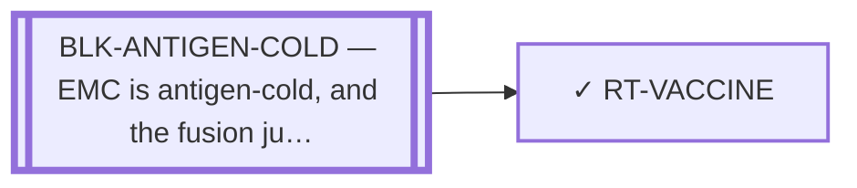

<!-- GENERATED FILE — DO NOT EDIT. Regenerate with:
     python3 systems/systems_check.py --write-views
     Source of truth: systems/graph/*.json -->

# RT-VACCINE — Fusion-junction vaccine / HLA-coverage paper

**Family:** [ST-IMMUNO](L1-st-immuno.md) · **state:** ✓ parked · computed · confidence low · verified 2026-08-28

**Grade** (owned by [`research/manuscripts/neoantigen/hla-coverage-emc.md`](../../research/manuscripts/neoantigen/hla-coverage-emc.md)): PARKED — done, not a treatment path; a self-adjacent junction in a cold tumour is a weak immunogen ⭐ RE-GRADED ON THE RECOMPUTED COVERAGE (2026-08-28) AND THE PARKING SURVIVES — COVERAGE MOVED AGAINST THE ROUTE, NOT FOR IT. Class I fell on the corrected transcript-model junction: the public e7::e3 junction is presented on HLA-B*15:01 alone, and the any-strong-binder set lost two alleles. ⛔ AND THE CLASS-II ARM IS NO LONGER WITHHELD — that claim was FALSE against the committed artifacts and had been since 2026-08-22. patient-cd4-demo.json is rebuilt on the corrected seam (`QYSQQSSSYGQQ\|NMPCVQAQYSPS`, grade EMITTABLE), hla_coverage.py's own ⛔_class_ii_provenance records `matches_corrected_seam: true` with no banner, and the coverage artifact carries class-II and both-arms figures. The class-II result is itself weak: ONE strong binder on ONE allele across a 23-allele DR/DP/DQ panel in which every declared allele was scored. ⚠ The re-grade therefore changes nothing about the parking, which rests on BLK-ANTIGEN-COLD — immunogenicity of a self-adjacent junction in a cold tumour — and not on coverage. Figures are owned by ART-HLA-COVERAGE and are not re-typed here.

## What has to land for this route to move

**Reading it.** A solid arrow is what holds this route down today. A dashed arrow is a capability that WOULD retire a blocker — dashed because it has not landed, and the date beside it is a forecast, not a schedule.

⛔ **1 of these is permanent** (`BLK-ANTIGEN-COLD`) — a fact about the biology, drawn double-walled, with no way out by definition. No technology arrives to fix it.

✓ Already cleared by this route: `BLK-PARALOGUE-DDG`, `BLK-TERNARY-GEOMETRY`.

## Scientific rationale

If the junction peptide is presented, a vaccine is the cheapest way to point the immune system at it, and its HLA-coverage analysis is reusable regardless of whether the vaccine itself proceeds.

## Remaining unknowns

- Whether a self-adjacent junction in a cold tumour can be immunogenic at all — the premise the parking rests on.
- Whether the underlying antigen prediction survives the exon-index correction; it inherits that defect.

## Required validation

| what | instrument | feasible today | blocked by |
|---|---|---|---|
| Evidence of immunogenicity for a self-adjacent junction | ⛔ none built | **no** | BLK-ANTIGEN-COLD |

## Blockers

| blocker | kind | what would retire it |
|---|---|---|
| **BLK-ANTIGEN-COLD** | `fundamental_biological_limit` | *permanent* |

## Blockers this route RETIRES

- **BLK-PARALOGUE-DDG** — The paralogue ΔΔG margin — selectivity that reduces to exp(−ΔΔG/RT)
- **BLK-TERNARY-GEOMETRY** — Ternary geometry — assembly, E3, exit vector, ubiquitin transfer

## Not to be confused with

| route | the axis it turns on | blockers the distinction turns on | why |
|---|---|---|---|
| [RT-JUNCTION-NEOANTIGEN](L2-rt-junction-neoantigen.md) | antigen vs product | `BLK-NO-EMC-DATA` | the vaccine is one product built on the antigen; parking the product does not park the antigen, whose HLA-coverage output still feeds TCR-T eligibility |

## Readiness — what this could become today

**`internal_note`**

its antigen input is no longer void — it is regenerated. What now blocks it is COVERAGE on the public junction and, above that, immunogenicity. ⚠ Superseded, retained: "≈8.5% on the public junction, ≈27% pooled, and a class-II arm still on the retracted seam." The two class-I figures are unchanged and are owned by ART-HLA-COVERAGE; the class-II half of that sentence was FALSE when this record last carried it — the demo was rebuilt on the corrected seam and the coverage module records the match — and the arm is reported rather than withheld. Corrected 2026-08-28 against the committed artifacts.

**Missing:**
- an immunogenicity argument

## Where this route ends — the paper

**[PUB-HLA-COVERAGE](L3-publications.md)** — [Population coverage of a public EWSR1::NR4A3 fusion-neoantigen immunotherapy in extraskeletal myxoid chondrosarcoma: a r](../../research/manuscripts/neoantigen/hla-coverage-emc.md)

`primary` · ◐ `drafted` · aimed at `preprint`

**This route contributes:** The population-coverage computation, which stands on its own as an eligibility ceiling even while the antigen above it is void.

**The paper would claim:** If a public junction epitope were presented, the fraction of the patient population whose HLA alleles could see it is computable from reference allele frequencies — an eligibility ceiling that constrains every junction-directed immunotherapy route and is reusable independently of whether the epitope itself survives.

## Strategic timing — the wait equation

**Recommendation: `monitor`**

Parked on a property of the tumour and the junction rather than of the modality, so it waits on a measurement rather than on effort.

| horizon | effect |
|---|---|
| Six months | None. |
| Two years | Only via a measured presentation result. |
| Cost trend | flat |
| Automation outlook | The prediction half is automated; the immunogenicity question is not computational. |

**Revisit when:**
- **TECH-JUNCTION-PMHC** — A fusion-junction presentation or immunogenicity predictor validated ON FUSION JUNCTIONS, or a TCR/ImmTAC discovery platform demon *(expected 2029, basis `extrapolated`)*

## Claim ceiling — what this route may NOT be used to claim

*Inherited from [ST-IMMUNO](L1-st-immuno.md), which is where these are asserted — a family limitation binds every route inside it.*

- EMC is antigen-cold and the fusion junction is a weak peptide-HLA — a property of this tumour and this junction, not of any modality here.
- Surface-antigen selectivity was measured on cell-line surrogates rather than on EMC tissue, so the negatives are as provisional as the positives would have been.
- One route's predicted binders span junction seams that a corrected exon index says do not exist; that result is void and the question is open.

## Closure

`premise_false` — Parked on immunogenicity — a self-adjacent junction in a cold tumour — and its HLA-coverage output is reusable and still feeds TCR-T eligibility.

## Best next action

⭐ THE RE-GRADE THIS FIELD ASKED FOR IS DONE (2026-08-28) AND THE ROUTE STAYS PARKED. Superseded, retained: "Re-grade on the recomputed coverage. The HLA-coverage output is reusable but its class-I figures moved by ~3× and its class-II figures are withheld." ⛔ THE SECOND HALF OF THAT SENTENCE WAS ALREADY FALSE WHEN IT WAS WRITTEN INTO THE QUEUE: the class-II figures are computed and committed. The re-grade's outcome is that coverage moved AGAINST the route and immunogenicity — BLK-ANTIGEN-COLD — is unchanged, so `parked` is the right state and TECH-JUNCTION-PMHC remains what would reopen it. Nothing free is left open on this route; the reusable half is the coverage computation, which feeds TCR-T eligibility through RT-JUNCTION-NEOANTIGEN.

*Cost:* $0

## What this route rests on — drill down

*L4 instruments and L5 objects, evidence and artifacts. Every row here is asserted by this route; the [evidence base](L5-evidence-base.md) shows the same edges from the other end.*

| L4 instrument | cited as | known-answer control |
|---|---|---|
| [INS-HLA-COVERAGE](registers/instruments.md) — HLA population-coverage calculator | **disclosed failing** | `none` |

**L5 objects:** [OBJ-MODEL-E7E3](L5-evidence-base.md#objects--the-biological-and-molecular-entities-the-program-reasons-about)

**L5 artifacts:** [ART-HLA-COVERAGE](L5-evidence-base.md#artifacts--the-files-a-claim-can-be-checked-against)

[← ST-IMMUNO](L1-st-immuno.md) · [← L0](L0-ecosystem.md)
