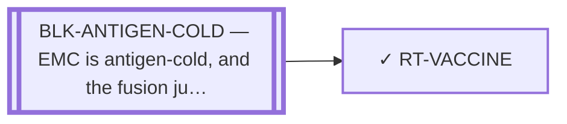

<!-- GENERATED FILE — DO NOT EDIT. Regenerate with:
     python3 systems/systems_check.py --write-views
     Source of truth: systems/graph/*.json -->

# RT-VACCINE — Fusion-junction vaccine / HLA-coverage paper

**Family:** [ST-IMMUNO](L1-st-immuno.md) · **state:** ✓ parked · computed · confidence low · verified 2026-08-05

**Grade** (owned by [`research/manuscripts/hla-coverage-emc.md`](../../research/manuscripts/hla-coverage-emc.md)): PARKED — done, not a treatment path; a self-adjacent junction in a cold tumour is a weak immunogen

## What has to land for this route to move

**Reading it.** A solid arrow is what holds this route down today. A dashed arrow is a capability that WOULD retire a blocker — dashed because it has not landed, and the date beside it is a forecast, not a schedule.

⛔ **1 of these is permanent** (`BLK-ANTIGEN-COLD`) — a fact about the biology, drawn double-walled, with no way out by definition. No technology arrives to fix it.

✓ Already cleared by this route: `BLK-PARALOGUE-DDG`, `BLK-TERNARY-GEOMETRY`.

## Scientific rationale

If the junction peptide is presented, a vaccine is the cheapest way to point the immune system at it, and its HLA-coverage analysis is reusable regardless of whether the vaccine itself proceeds.

## Remaining unknowns

- Whether a self-adjacent junction in a cold tumour can be immunogenic at all — the premise the parking rests on.
- Whether the underlying antigen prediction survives the exon-index correction; it inherits that defect.

## Required validation

| what | instrument | feasible today | blocked by |
|---|---|---|---|
| Evidence of immunogenicity for a self-adjacent junction | ⛔ none built | **no** | BLK-ANTIGEN-COLD |

## Blockers

| blocker | kind | what would retire it |
|---|---|---|
| **BLK-ANTIGEN-COLD** | `fundamental_biological_limit` | *permanent* |

## Blockers this route RETIRES

- **BLK-PARALOGUE-DDG** — The paralogue ΔΔG margin — selectivity that reduces to exp(−ΔΔG/RT)
- **BLK-TERNARY-GEOMETRY** — Ternary geometry — assembly, E3, exit vector, ubiquitin transfer

## Readiness — what this could become today

**`internal_note`**

Parked on immunogenicity, and its antigen input inherits the void prediction above it. The HLA-coverage output is reusable and does feed eligibility analysis elsewhere.

**Missing:**
- an immunogenicity argument

## Strategic timing — the wait equation

**Recommendation: `monitor`**

Parked on a property of the tumour and the junction rather than of the modality, so it waits on a measurement rather than on effort.

| horizon | effect |
|---|---|
| Six months | None. |
| Two years | Only via a measured presentation result. |
| Cost trend | flat |
| Automation outlook | The prediction half is automated; the immunogenicity question is not computational. |

**Revisit when:**
- **TECH-EMC-EXPRESSION-DATA** — A fetchable public EMC RNA-seq or proteomics deposit beyond the single existing model, enabling a target-regulon readout and per-a *(expected 2029, basis `speculative`)*

## Closure

`premise_false` — Parked on immunogenicity — a self-adjacent junction in a cold tumour — and its HLA-coverage output is reusable and still feeds TCR-T eligibility.

## Best next action

Keep the HLA-coverage output as a reusable input to eligibility analysis. Do not advance the vaccine while the antigen is void.

*Cost:* $0

[← ST-IMMUNO](L1-st-immuno.md) · [← L0](L0-ecosystem.md)
