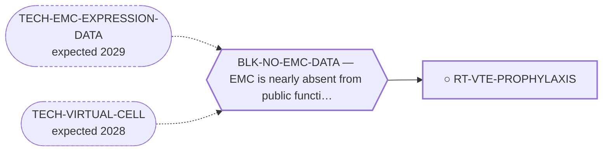

<!-- GENERATED FILE — DO NOT EDIT. Regenerate with:
     python3 systems/systems_check.py --write-views
     Source of truth: systems/graph/*.json -->

# RT-VTE-PROPHYLAXIS — Venous thromboembolism in a lung-metastatic sarcoma population

**Family:** [ST-MORTALITY-MECHANISM](L1-st-mortality-mechanism.md) · **state:** ○ ready · concept · confidence low · verified 2026-08-09

**Grade** (owned by [`research/manuscripts/emc-mortality-mechanisms.md`](../../research/manuscripts/emc-mortality-mechanisms.md)): ⭑ Registered 2026-08-09 from trimcrae's mechanism-of-death question; the family this route sits in did not exist before that day.

## What has to land for this route to move

**Reading it.** A solid arrow is what holds this route down today. A dashed arrow is a capability that WOULD retire a blocker — dashed because it has not landed, and the date beside it is a forecast, not a schedule.

## Scientific rationale

A patient carrying pulmonary metastases for years is exposed to a thrombotic hazard for that whole period, and pulmonary embolism is one of the few mechanisms by which an indolent disease can kill abruptly. The route is registered with its own most likely negative attached: the randomised prophylaxis trials in ambulatory cancer reduced thromboembolic events, and reducing events is not the same as prolonging life. That distinction is the route's central question rather than a caveat on it.

## Remaining unknowns

- Whether thromboembolism appears as a terminal event in the EMC record at all, which the corpus can answer and nobody has asked.
- Whether prophylaxis moves overall survival as opposed to event rates -- the published trials are the place to check, and the expected answer is no.
- Whether a sarcoma population carries the thrombotic risk that would make any of this worth acting on, which is a class-level question this disease has no data for.

## Required validation

| what | instrument | feasible today | blocked by |
|---|---|---|---|
| Terminal thromboembolic events counted in the retrieved corpus | ⛔ none built | yes | — |
| A survival endpoint from the ambulatory-prophylaxis trials, read rather than assumed | ⛔ none built | yes | — |
| An EMC-specific thrombotic risk estimate, which requires a clinical cohort | ⛔ none built | **no** | BLK-NO-EMC-DATA |

## Blockers

| blocker | kind | what would retire it |
|---|---|---|
| **BLK-NO-EMC-DATA** | `insufficient_data` | `TECH-EMC-EXPRESSION-DATA`, `TECH-VIRTUAL-CELL` |

## Readiness — what this could become today

**`internal_note`**

Registered 2026-08-09 at concept maturity; the honest output today is the question and its cheapest next observation.

## Where this route ends — the paper

**[PUB-MORTALITY-MECHANISM](L3-publications.md)** — [What kills patients with extraskeletal myxoid chondrosarcoma, and the survival available to tumour-directed therapy: a cause-of-death and relative-survival analysis of the published record](../../research/manuscripts/emc-mortality-mechanisms-paper.md)

`contributing` · ◐ `drafted` · aimed at `preprint`

**This route contributes:** A mechanism that is plausible, acute and probably small -- carried because a portfolio that only registers the mechanisms it expects to find is not a census.

**The paper would claim:** In extraskeletal myxoid chondrosarcoma the published record does not state a mechanism for most recorded deaths; where it does, competing causes and second malignancies are the largest identifiable category and respiratory failure is not dominant. Between a fifth and a third of deaths after diagnosis are not attributed to the tumour -- a figure relative survival and registry cause attribution agree on despite sharing no input -- so the survival available to all antitumour therapy taken together is bounded at 6.7 percentage points in localised disease against 31.0 in metastatic disease.

## Strategic timing — the wait equation

**Recommendation: `pursue_now`**

Both observations come out of retrievals already dispatched, and a route whose expected answer is negative is cheapest to settle immediately rather than to carry.

| horizon | effect |
|---|---|
| Cost trend | flat |

## Claim ceiling — what this route may NOT be used to claim

*Inherited from [ST-MORTALITY-MECHANISM](L1-st-mortality-mechanism.md), which is where these are asserted — a family limitation binds every route inside it.*

- The competing-mortality figure is arithmetic on published summary percentages from heterogeneous studies, not a competing-risks model, and most pairings cross populations.
- Every supportive-care effect size available to this family was measured in some other cancer; no EMC-specific supportive-care outcome data exists at all.
- Nothing in this family asserts efficacy, safety, a therapeutic window or clinical readiness, and a mechanism being common is not evidence that treating it changes survival.

## Best next action

Count thromboembolic terminal events in the corpus and read the prophylaxis trials for a survival endpoint rather than an event endpoint.

*Cost:* $0

[← ST-MORTALITY-MECHANISM](L1-st-mortality-mechanism.md) · [← L0](L0-ecosystem.md)
