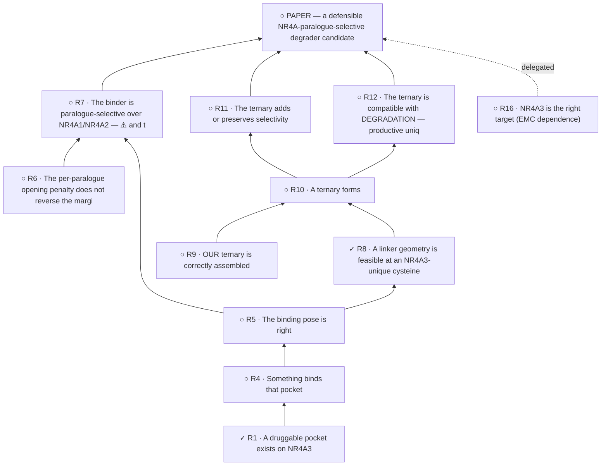

<!-- GENERATED FILE — DO NOT EDIT. Regenerate with:
     python3 systems/systems_check.py --write-views
     Source of truth: systems/graph/*.json -->

# Requirement register

> **The weakest cell sets the ceiling.** A requirement can never be claimed more strongly than
> the instrument underneath it supports — and an instrument whose known-answer control FAILED
> and one that has NO control are different facts, neither of which is support.

| id | requirement | work | auth | served by | usable answer? |
|---|---|---|---|---|---|
| **R1** | A druggable pocket exists on NR4A3 | ✓ | — | `V13` `V14` `V15` | V15 |
| **R2** | That state is thermodynamically accessible at equilibrium (Gate 3B) | ○ | — | `V13` | ⛔ **none has returned one** |
| **R3** | The receptor frame denovo_401 was generated into still qualifies — the paper's explicit submission gate | ✕ | — | — | ⛔ **no instrument at all** |
| **R4** | Something binds that pocket | ○ | — | — | ⛔ **no instrument at all** |
| **R5** | The binding pose is right | ○ | — | `V3` | ⛔ **none has returned one** |
| **R6** | The per-paralogue opening penalty does not reverse the margin — ΔG_open | ○ | 🔒 | — | ⛔ **no instrument at all** |
| **R7** | The binder is paralogue-selective over NR4A1/NR4A2 — ⚠ and the two halves are NOT the same requirement: NR4A1-sparing is a hard constraint with a name | ○ | 🔒 | `V4` `V6` `V7` `V8` `V9` `V10` | V6 · V8 · V10 |
| **R8** | A linker geometry is feasible at an NR4A3-unique cysteine | ✓ | — | `V17` | ⛔ **none has returned one** |
| **R9** | OUR ternary is correctly assembled | ○ | 🔒 | `V2` | V2 |
| **R10** | A ternary forms | ○ | 🔒 | `V2` `V12` | V2 |
| **R11** | The ternary adds or preserves selectivity | ○ | 🔒 | `V1` `V5` `V11` `V16` | V1 |
| **R12** | The ternary is compatible with DEGRADATION — productive unique-lysine geometry | ○ | — | `V18` | ⛔ **none has returned one** |
| **R13** | The modelled object is the real biological object — EWSR1::NR4A3 in fusion context, not an isolated LBD | ○ | 🔒 | — | ⛔ **no instrument at all** |
| **R14** | Selectivity claims are bounded to their tested scope — the AR/MR superfamily cross-binding check | ○ | 🔒 | `V21` | ⛔ **none has returned one** |
| **R15** | The candidate set is chemically constructible and physicochemically plausible | ✓ | — | `V17` | ⛔ **none has returned one** |
| **R16** | NR4A3 is the right target (EMC dependence) | ○ | — | — | ⛔ **no instrument at all** |

## The two kinds of gap — which must never be filed together

⛔ **Filing these under one word is how the cheap one stays invisible.** A requirement with no
instrument needs something BUILT or a bench; one whose instruments have all failed needs a
better METHOD. Opposite work items, opposite costs.

**No instrument exists at all (5):** **R3** — The receptor frame denovo_401 was generated into still qualifies — the, **R4** — Something binds that pocket, **R6** — The per-paralogue opening penalty does not reverse the margin — ΔG_ope, **R13** — The modelled object is the real biological object — EWSR1::NR4A3 in fu, **R16** — NR4A3 is the right target (EMC dependence)

**An instrument exists but none has returned a usable answer (6):** **R2** (V13), **R5** (V3), **R8** (V17), **R12** (V18), **R14** (V21), **R15** (V17)

## R x V coverage matrix

Read down a column: the weakest cell sets the ceiling. A column with no cell is a hole.

| requirement | `V1` | `V2` | `V3` | `V4` | `V5` | `V6` | `V7` | `V8` | `V9` | `V10` | `V11` | `V12` | `V13` | `V14` | `V15` | `V16` | `V17` | `V18` | `V19` | `V20` | `V21` | `V22` |
|---|---|---|---|---|---|---|---|---|---|---|---|---|---|---|---|---|---|---|---|---|---|---|
| **R1** |  |  |  |  |  |  |  |  |  |  |  |  | ✕ | ○ | ◐ |  |  |  |  |  |  |  |
| **R2** |  |  |  |  |  |  |  |  |  |  |  |  | ✕ |  |  |  |  |  |  |  |  |  |
| **R3** |  |  |  |  |  |  |  |  |  |  |  |  |  |  |  |  |  |  |  |  |  |  |
| **R4** |  |  |  |  |  |  |  |  |  |  |  |  |  |  |  |  |  |  |  |  |  |  |
| **R5** |  |  | ⚠ |  |  |  |  |  |  |  |  |  |  |  |  |  |  |  |  |  |  |  |
| **R6** |  |  |  |  |  |  |  |  |  |  |  |  |  |  |  |  |  |  |  |  |  |  |
| **R7** |  |  |  | ○ |  | ✓ | ✕ | ✓ | ○ | ✓ |  |  |  |  |  |  |  |  |  |  |  |  |
| **R8** |  |  |  |  |  |  |  |  |  |  |  |  |  |  |  |  | ✕ |  |  |  |  |  |
| **R9** |  | ✓ |  |  |  |  |  |  |  |  |  |  |  |  |  |  |  |  |  |  |  |  |
| **R10** |  | ✓ |  |  |  |  |  |  |  |  |  | ✕ |  |  |  |  |  |  |  |  |  |  |
| **R11** | ✓ |  |  |  | ✕ |  |  |  |  |  | ✕ |  |  |  |  | ○ |  |  |  |  |  |  |
| **R12** |  |  |  |  |  |  |  |  |  |  |  |  |  |  |  |  |  | ○ |  |  |  |  |
| **R13** |  |  |  |  |  |  |  |  |  |  |  |  |  |  |  |  |  |  |  |  |  |  |
| **R14** |  |  |  |  |  |  |  |  |  |  |  |  |  |  |  |  |  |  |  |  | ✕ |  |
| **R15** |  |  |  |  |  |  |  |  |  |  |  |  |  |  |  |  | ✕ |  |  |  |  |  |
| **R16** |  |  |  |  |  |  |  |  |  |  |  |  |  |  |  |  |  |  |  |  |  |  |

*Legend: ✓ recovered a known answer · ◐ mixed — its controls do not all support it · ⚠ inconclusive · ✕ its control failed · ○ no control exists. An empty cell means the instrument does not serve that requirement.*

## The dependency graph

Read upward: a box can only be claimed once everything feeding it holds. Node state is the
requirement's work state, so the graph reads the same without colour.

⚠ **Not every requirement is drawable here, and that is a property of the graph rather than of
them.** A requirement that BOUNDS every node — a scope or submission condition — cannot be shown
as an ordinary box without implying it can be discharged in sequence, which it cannot. Those
appear in the register above and nowhere in this diagram.

## Detail

### R1 — A druggable pocket exists on NR4A3

- **work state:** ✓ ✓ work complete
- **authorization:** —
- **served by:** `V13` `V14` `V15`
- **⛔ claim ceiling today:** supported, not settled. Gate 1 (a two-state cryptic *opening*) FAILED as registered and was reformulated to basin-internal breathing; the existence evidence is experimental and independent (8XTT) — see §5 row R1

### R2 — That state is thermodynamically accessible at equilibrium (Gate 3B)

- **work state:** ○ ○ future
- **authorization:** —
- **served by:** `V13`
- **⛔ claim ceiling today:** unresolved. Reading Gate 3B off a *single* biased F(Rg) profile is conclusively closed (§6a); no replacement reading has been run

### R3 — The receptor frame denovo_401 was generated into still qualifies — the paper's explicit submission gate

- **work state:** ✕ ✕ REFUTED 2026-08-03
- **authorization:** — ($0, spent)
- **served by:** ⛔ nothing
- **⛔ claim ceiling today:** ⛔ MEASURED FALSE. Under the harmonized, score-independent definition the generation frame's mapped orthosteric site is detected and not druggable, so the requirement's own statement does not hold. Per the paper, this *"reaches the generation receptor … not merely a reported frame-fraction"*. ⚠ This is the requirement register's FIRST ✕, and §0.2 is explicit that *"a claim that has been refuted is dead, and should say so"* — flagged for trimcrae rather than applied silently, because it changes what the paper may claim about every denovo_401-derived result. ⚠ The verdict is rule-sensitive and th

### R4 — Something binds that pocket

- **work state:** ○ ○ future
- **authorization:** —
- **served by:** ⛔ nothing
- **⛔ claim ceiling today:** nothing binds the cryptic pocket, of any molecule. ⚠ Scoping is load-bearing: NR4A3 *is* experimentally ligandable (§5 row R4); the cryptic site is what has no ligand

### R5 — The binding pose is right

- **work state:** ○ ○ future (re-run)
- **authorization:** —
- **served by:** `V3`
- **⛔ claim ceiling today:** unresolved, and this row understated it. The docking works; the pipeline's site selection missed on 6 of 6 pairs, so the pose's weight rests on the site being right and V3 could not check that. ⛔ Two results landed 2026-08-03 and both go against the row. *(a)* Re-asked in regime — on the three proteins the pipeline actually transfers Pocket-5 onto — the site question is answered 0 of 14 gradeable pairs, by TWO independent transfer routes (sequence and Pocket-5 structure), while an fpocket-chosen box finds it in 11; so the miss is the transfer, not the docking, and it is no longer an n = 6 obse

### R6 — The per-paralogue opening penalty does not reverse the margin — ΔG_open

- **work state:** ○ ○ future
- **authorization:** 🔒 explicit nod
- **served by:** ⛔ nothing
- **⛔ claim ceiling today:** ⛔ every ABSOLUTE ΔΔG on the binder path is conditional on a term nobody has computed. Validation requirement 2: matched-open comparison can *"miss or REVERSE selectivity"*. ⚠ Narrowed 2026-08-03, and this page stated it too widely: the block is on the absolute route to R7, not on a ligand-side *relative* double difference, in which the opening penalty is common to both ligands of a matched pair and cancels inside each protein — §3.4 fact 3. ⚠ *Superseded, retained: "every ΔΔG on the binder path".*

### R7 — The binder is paralogue-selective over NR4A1/NR4A2 — ⚠ and the two halves are NOT the same requirement: NR4A1-sparing is

- **work state:** ○ ○ open — the existing result is ⏸ parked
- **authorization:** 🔒 (V4)
- **served by:** `V4` `V6` `V7` `V8` `V9` `V10`
- **⛔ claim ceiling today:** ⛔ an unvalidated prediction. Three separate blocks, only one of which is the instrument — see §8

### R8 — A linker geometry is feasible at an NR4A3-unique cysteine

- **work state:** ✓ ✓ computed — ⚠ not reconciled to its artifact
- **authorization:** — ($0 CPU)
- **served by:** `V17`
- **⛔ claim ceiling today:** geometry only. No thiol pKa, reactivity, adduct or degradation quantity; reach is necessary and never sufficient. And it is conditional on R5

### R9 — OUR ternary is correctly assembled

- **work state:** ○ ○ future — NOT STARTED
- **authorization:** — ($0, needs no nod) — rung 5b-T, priced and gated 2026-08-02. ⚠ *Superseded, retained: "🔒 unpriced, no rung."*
- **served by:** `V2`
- **⛔ claim ceiling today:** ⛔ no NR4A3 ternary has been correctly assembled by anyone. §what the SMARCA2/4 null BINDS: *"⛔ NO, and this is the whole remaining gap."* ⚠ 5b-T gives it a route and a gate; it does not make the claim, and its output is structural, never thermodynamic

### R10 — A ternary forms

- **work state:** ○ ○ future
- **authorization:** 🔒 (via R9)
- **served by:** `V2` `V12`
- **⛔ claim ceiling today:** the existing prediction was built by the failing route and its molecule is unrecoverable, so it cannot be replicated

### R11 — The ternary adds or preserves selectivity

- **work state:** ○ ○ future
- **authorization:** 🔒 (via R9)
- **served by:** `V1` `V5` `V11` `V16`
- **⛔ claim ceiling today:** one sequence-encoded candidate at 1 model per arm against a reproducibility bar of 3 (C18)

### R12 — The ternary is compatible with DEGRADATION — productive unique-lysine geometry

- **work state:** ○ ○ future
- **authorization:** — ($0 screen)
- **served by:** `V18`
- **⛔ claim ceiling today:** categorical input only (4 NR4A3-unique lysines, 3 exposed — C7, ⛔ the exposure cutoff that FAILS its own positive control). Validation requirement 5's honest limit: real degraders often ubiquitinate several lysines and lysine-less substrates can still be degraded, so this raises the odds; it does not guarantee the paralogue is spared

### R13 — The modelled object is the real biological object — EWSR1::NR4A3 in fusion context, not an isolated LBD

- **work state:** ○ ○ not started
- **authorization:** R13-a: — ($0, needs no nod) · R13-b: 🔒 — PRICED and GATED 2026-08-03, rung S. ⚠ *Superseded, retained: "🔒 unpriced".*
- **served by:** ⛔ nothing
- **⛔ claim ceiling today:** ⛔ every geometry claim on this page is about an isolated LBD construct. Validation requirement 5 asks for the fusion-context ensemble, lysines outside the LBD (hinge, DBD, fusion partner) and full CRL/E2~Ub ensembles

### R14 — Selectivity claims are bounded to their tested scope — the AR/MR superfamily cross-binding check

- **work state:** ○ ○ not started
- **authorization:** R14-a: — ($0, needs no nod) · R14-b: 🔒 + ⛔ blocked by the rate line — PRICED and GATED 2026-08-03, rung S. ⚠ *Superseded, retained: "🔒 unpriced".*
- **served by:** `V21`
- **⛔ claim ceiling today:** the selectivity claim is currently bounded to two paralogues by a check whose instrument cannot be read. ⛔ MEASURED 2026-08-03, and it is worse than "unrun": the panel is now complete (MR/NR3C2 added and it PASSES) and its never-run cognate-ligand self-control RAN and FAILED on 3 of 10 receptors, so panel_readable: false and all four SI §S1 anti-target clauses are measured-unreadable, not merely unverified — antitarget-selfcontrol.json → selfcontrol. ⚠ *Superseded, retained: "currently bounded to two paralogues by an unrun check".* SI names MR/AR *"the sole sequence-level non-paralogue follow-

### R15 — The candidate set is chemically constructible and physicochemically plausible

- **work state:** ✓ ✓ work complete for one mechanism per molecule — ⚠ and a named candidate now exists AT the 12-atom gate (§5 row R15)
- **authorization:** — ($0)
- **served by:** `V17`
- **⛔ claim ceiling today:** one mechanism per molecule. The two-mechanism construct needs a two-branch template, which is a design change to a preregistered enumeration and the decision has never been asked for (§10). ⛔ And the library's own provenance is open — its generator no longer reproduces it, which reaches the causal test article: §10.1 row 25

### R16 — NR4A3 is the right target (EMC dependence)

- **work state:** ○ ○ future — DELEGATED
- **authorization:** —
- **served by:** ⛔ nothing
- **⛔ claim ceiling today:** not a blocker of this paper. :2508: *"This paper's claimed contribution is the target's computational druggability/selectivity, not EMC efficacy"*

[← L0](../L0-ecosystem.md) · [instrument register](instruments.md)
